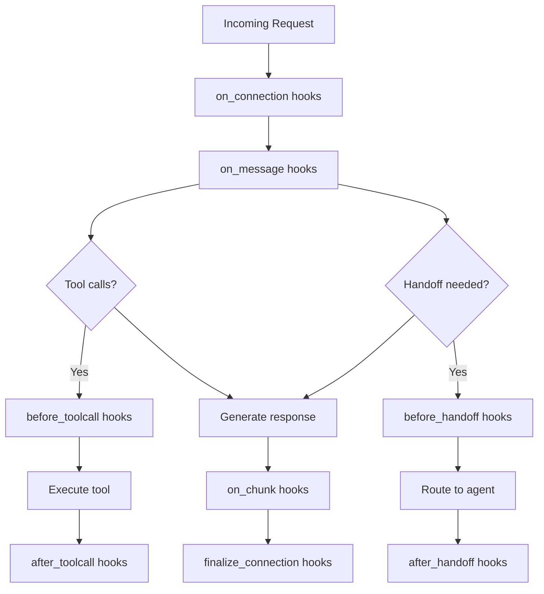

# Lifecycle

Understanding the request lifecycle and hook system in BaseAgent.

## Request Lifecycle



## Lifecycle Hooks

### Available Hooks

1. **on_connection** - Request initialized
2. **on_message** - Each message processed
3. **before_toolcall** - Before tool execution
4. **after_toolcall** - After tool execution
5. **on_chunk** - Each streaming chunk
6. **before_handoff** - Before agent handoff
7. **after_handoff** - After agent handoff
8. **finalize_connection** - Request complete

!!! note

    `finalize_connection` runs for cleanup even when a prior hook raises a structured error (for example, a 402 payment/auth error). Implement finalize hooks to be idempotent and safe when required context (like a payment token) is missing.

### Hook Registration

```python
from webagents.agents.skills import Skill
from webagents.agents.skills.decorators import hook

class AnalyticsSkill(Skill):
    @hook("on_connection", priority=10)
    async def track_request(self, context):
        """Track incoming request"""
        print(f"New request: {context.completion_id}")
        return context
    
    @hook("on_message", priority=20)
    async def analyze_message(self, context):
        """Analyze each message"""
        message = context.messages[-1]
        print(f"Message role: {message['role']}")
        return context
    
    @hook("on_chunk", priority=30)
    async def monitor_streaming(self, context):
        """Monitor streaming chunks"""
        chunk_size = len(context.get("content", ""))
        print(f"Chunk size: {chunk_size}")
        return context
```

## Hook Priority

Hooks execute in priority order (lower numbers first):

```python
class SecuritySkill(Skill):
    @hook("before_toolcall", priority=1)  # Runs first
    async def validate_security(self, context):
        """Security check before tools"""
        tool_name = context["tool_call"]["function"]["name"]
        if self.is_dangerous(tool_name):
            raise SecurityError("Tool blocked")
        return context

class LoggingSkill(Skill):
    @hook("before_toolcall", priority=10)  # Runs second
    async def log_tool_usage(self, context):
        """Log tool execution"""
        self.log_tool(context["tool_call"])
        return context
```

## Context During Lifecycle

### Connection Context

```python
@hook("on_connection")
async def on_connect(self, context):
    # Available in context:
    # - messages: List[Dict]
    # - stream: bool
    # - peer_user_id: str
    # - completion_id: str
    # - model: str
    # - agent_name: str
    # - agent_skills: Dict[str, Skill]
    return context
```

### Message Context

```python
@hook("on_message")
async def on_msg(self, context):
    # Same as connection + current message
    current_message = context.messages[-1]
    role = current_message["role"]
    content = current_message["content"]
    return context
```

### Tool Context

```python
@hook("before_toolcall")
async def before_tool(self, context):
    # Additional context:
    # - tool_call: Dict with function details
    # - tool_id: str
    return context

@hook("after_toolcall")
async def after_tool(self, context):
    # Additional context:
    # - tool_result: str (execution result)
    return context
```

### Streaming Context

```python
@hook("on_chunk")
async def on_chunk(self, context):
    # Additional context:
    # - chunk: Dict (OpenAI format)
    # - content: str (chunk content)
    # - chunk_index: int
    # - full_content: str (accumulated)
    return context
```

## Practical Examples

### Request Logging

```python
class RequestLogger(Skill):
    @hook("on_connection")
    async def start_logging(self, context):
        self.start_time = time.time()
        self.request_id = context.completion_id
        await self.log_request_start(context)
        return context
    
    @hook("finalize_connection")
    async def end_logging(self, context):
        duration = time.time() - self.start_time
        await self.log_request_complete(
            self.request_id,
            duration,
            context.get("usage", {})
        )
        return context
```

### Content Filtering

```python
class ContentFilter(Skill):
    @hook("on_message", priority=5)
    async def filter_input(self, context):
        """Filter inappropriate input"""
        message = context.messages[-1]
        if message["role"] == "user":
            filtered = self.filter_content(message["content"])
            context.messages[-1]["content"] = filtered
        return context
    
    @hook("on_chunk", priority=5)
    async def filter_output(self, context):
        """Filter streaming output"""
        content = context.get("content", "")
        if self.is_inappropriate(content):
            context["chunk"]["choices"][0]["delta"]["content"] = "[filtered]"
        return context
```

### Performance Monitoring

```python
class PerformanceMonitor(Skill):
    def __init__(self, config=None):
        super().__init__(config)
        self.metrics = {}
    
    @hook("before_toolcall")
    async def start_timer(self, context):
        tool_id = context["tool_id"]
        self.metrics[tool_id] = {"start": time.time()}
        return context
    
    @hook("after_toolcall")
    async def record_duration(self, context):
        tool_id = context["tool_id"]
        duration = time.time() - self.metrics[tool_id]["start"]
        await self.record_metric(
            "tool_duration",
            duration,
            {"tool": context["tool_call"]["function"]["name"]}
        )
        return context
```

## Best Practices

1. **Use Priorities** - Order hooks appropriately
2. **Return Context** - Always return modified context
3. **Handle Errors** - Gracefully handle exceptions
4. **Minimize Overhead** - Keep hooks lightweight
5. **Thread Safety** - Use context vars for state 