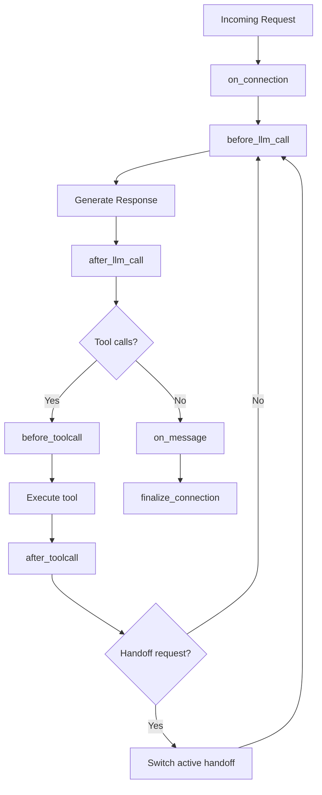

# Lifecycle

Understanding the request lifecycle and hook system in `BaseAgent`.

## Request Lifecycle


```mermaid
graph TD
    Request["Incoming Request"] --> Connection["on_connection"]
    Connection --> BeforeLLM["before_llm_call"]
    BeforeLLM --> LLM["Generate Response"]
    LLM --> AfterLLM["after_llm_call"]
    AfterLLM --> ToolCheck{"Tool calls?"}
    ToolCheck -->|Yes| BeforeTool["before_toolcall"]
    BeforeTool --> Execute["Execute tool"]
    Execute --> AfterTool["after_toolcall"]
    AfterTool --> IsHandoff{"Handoff request?"}
    IsHandoff -->|Yes| SwitchHandoff["Switch active handoff"]
    SwitchHandoff --> BeforeLLM
    IsHandoff -->|No| BeforeLLM
    ToolCheck -->|No| OnMessage["on_message"]
    OnMessage --> Finalize["finalize_connection"]
```

## Lifecycle Hooks

### Available Hooks

1. **on_connection** — Request initialized
2. **before_llm_call** — Before each LLM call (can modify messages and tools in context)
3. **after_llm_call** — After each LLM call (can inspect the response)
4. **before_toolcall** — Before tool execution
5. **after_toolcall** — After tool execution
6. **on_message** — After the agentic loop completes (full conversation available)
7. **on_chunk** — Each streaming chunk
8. **finalize_connection** — Request complete

> `finalize_connection` runs for cleanup even when a prior hook raises a structured error (for example, a 402 payment/auth error). Implement finalize hooks to be idempotent and safe when required context (like a payment token) is missing.

### Hook Registration

```typescript tab="TypeScript"
import { Skill, hook } from 'webagents';
import type { HookData, Context } from 'webagents';

class AnalyticsSkill extends Skill {
  readonly name = 'analytics';

  @hook({ lifecycle: 'on_connection', priority: 10 })
  async trackRequest(data: HookData, ctx: Context) {
    console.log(`New request: ${ctx.metadata.completion_id}`);
    return data;
  }

  @hook({ lifecycle: 'on_message', priority: 20 })
  async analyzeMessage(data: HookData, ctx: Context) {
    const last = data.messages?.at(-1);
    console.log(`Message role: ${last?.role}`);
    return data;
  }

  @hook({ lifecycle: 'on_chunk', priority: 30 })
  async monitorStreaming(data: HookData, ctx: Context) {
    const chunkSize = (data.content ?? '').length;
    console.log(`Chunk size: ${chunkSize}`);
    return data;
  }
}
```

```python tab="Python"
from webagents.agents.skills import Skill
from webagents.agents.skills.decorators import hook

class AnalyticsSkill(Skill):
    @hook("on_connection", priority=10)
    async def track_request(self, context):
        """Track incoming request"""
        print(f"New request: {context.completion_id}")
        return context

    @hook("on_message", priority=20)
    async def analyze_message(self, context):
        """Analyze each message"""
        message = context.messages[-1]
        print(f"Message role: {message['role']}")
        return context

    @hook("on_chunk", priority=30)
    async def monitor_streaming(self, context):
        """Monitor streaming chunks"""
        chunk_size = len(context.get("content", ""))
        print(f"Chunk size: {chunk_size}")
        return context
```

## Hook Priority

Hooks execute in priority order (lower numbers first):

```typescript tab="TypeScript"
import { Skill, hook } from 'webagents';

class SecuritySkill extends Skill {
  readonly name = 'security';

  @hook({ lifecycle: 'before_toolcall', priority: 1 })
  async validateSecurity(data, ctx) {
    const toolName = data.tool_call?.function?.name;
    if (this.isDangerous(toolName)) {
      throw new Error(`Tool blocked: ${toolName}`);
    }
    return data;
  }

  private isDangerous(name?: string) { return name === 'rm_rf_root'; }
}

class LoggingSkill extends Skill {
  readonly name = 'logging';

  @hook({ lifecycle: 'before_toolcall', priority: 10 })
  async logToolUsage(data, ctx) {
    this.logTool(data.tool_call);
    return data;
  }

  private logTool(_: unknown) {}
}
```

```python tab="Python"
class SecuritySkill(Skill):
    @hook("before_toolcall", priority=1)  # Runs first
    async def validate_security(self, context):
        """Security check before tools"""
        tool_name = context["tool_call"]["function"]["name"]
        if self.is_dangerous(tool_name):
            raise SecurityError("Tool blocked")
        return context

class LoggingSkill(Skill):
    @hook("before_toolcall", priority=10)  # Runs second
    async def log_tool_usage(self, context):
        """Log tool execution"""
        self.log_tool(context["tool_call"])
        return context
```

## Context During Lifecycle

### Connection Context

```typescript tab="TypeScript"
@hook({ lifecycle: 'on_connection' })
async onConnect(data: HookData, ctx: Context) {
  // Available on data / ctx:
  // data.messages   — Message[]
  // data.stream     — boolean
  // ctx.auth        — AuthInfo (peer_user_id, scopes)
  // ctx.metadata    — completion_id, model, agent_name
  // ctx.session     — SessionState
  return data;
}
```

```python tab="Python"
@hook("on_connection")
async def on_connect(self, context):
    # Available in context:
    # - messages: List[Dict]
    # - stream: bool
    # - peer_user_id: str
    # - completion_id: str
    # - model: str
    # - agent_name: str
    # - agent_skills: Dict[str, Skill]
    return context
```

### Message Context

```typescript tab="TypeScript"
@hook({ lifecycle: 'on_message' })
async onMsg(data: HookData, ctx: Context) {
  const current = data.messages!.at(-1)!;
  const role = current.role;
  const content = current.content;
  return data;
}
```

```python tab="Python"
@hook("on_message")
async def on_msg(self, context):
    # Same as connection + current message
    current_message = context.messages[-1]
    role = current_message["role"]
    content = current_message["content"]
    return context
```

### Tool Context

```typescript tab="TypeScript"
@hook({ lifecycle: 'before_toolcall' })
async beforeTool(data: HookData, ctx: Context) {
  // data.tool_call — { id, function: { name, arguments } }
  return data;
}

@hook({ lifecycle: 'after_toolcall' })
async afterTool(data: HookData, ctx: Context) {
  // data.tool_result — string
  return data;
}
```

```python tab="Python"
@hook("before_toolcall")
async def before_tool(self, context):
    # Additional context:
    # - tool_call: Dict with function details
    # - tool_id: str
    return context

@hook("after_toolcall")
async def after_tool(self, context):
    # Additional context:
    # - tool_result: str (execution result)
    return context
```

### Streaming Context

```typescript tab="TypeScript"
@hook({ lifecycle: 'on_chunk' })
async onChunk(data: HookData, ctx: Context) {
  // data.chunk        — OpenAI-format streaming chunk
  // data.content      — string (current chunk content)
  // data.chunk_index  — number
  // data.full_content — string (accumulated)
  return data;
}
```

```python tab="Python"
@hook("on_chunk")
async def on_chunk(self, context):
    # Additional context:
    # - chunk: Dict (OpenAI format)
    # - content: str (chunk content)
    # - chunk_index: int
    # - full_content: str (accumulated)
    return context
```

## Practical Examples

### Request Logging

```typescript tab="TypeScript"
import { Skill, hook } from 'webagents';

class RequestLogger extends Skill {
  readonly name = 'request-logger';
  private startTime = 0;
  private requestId = '';

  @hook({ lifecycle: 'on_connection' })
  async startLogging(data, ctx) {
    this.startTime = Date.now();
    this.requestId = String(ctx.metadata.completion_id ?? '');
    await this.logRequestStart(data, ctx);
    return data;
  }

  @hook({ lifecycle: 'finalize_connection' })
  async endLogging(data, ctx) {
    const duration = (Date.now() - this.startTime) / 1000;
    await this.logRequestComplete(this.requestId, duration, data.usage);
    return data;
  }

  private async logRequestStart(_d: unknown, _c: unknown) {}
  private async logRequestComplete(_id: string, _d: number, _u: unknown) {}
}
```

```python tab="Python"
import time
from webagents.agents.skills import Skill
from webagents.agents.skills.decorators import hook

class RequestLogger(Skill):
    @hook("on_connection")
    async def start_logging(self, context):
        self.start_time = time.time()
        self.request_id = context.completion_id
        await self.log_request_start(context)
        return context

    @hook("finalize_connection")
    async def end_logging(self, context):
        duration = time.time() - self.start_time
        await self.log_request_complete(
            self.request_id,
            duration,
            context.get("usage", {}),
        )
        return context
```

### Content Filtering

```typescript tab="TypeScript"
import { Skill, hook } from 'webagents';

class ContentFilter extends Skill {
  readonly name = 'content-filter';

  @hook({ lifecycle: 'on_message', priority: 5 })
  async filterInput(data, ctx) {
    const last = data.messages?.at(-1);
    if (last?.role === 'user') {
      last.content = this.filterContent(String(last.content ?? ''));
    }
    return data;
  }

  @hook({ lifecycle: 'on_chunk', priority: 5 })
  async filterOutput(data, ctx) {
    if (this.isInappropriate(data.content ?? '')) {
      data.chunk.choices[0].delta.content = '[filtered]';
    }
    return data;
  }

  private filterContent(s: string) { return s; }
  private isInappropriate(_: string) { return false; }
}
```

```python tab="Python"
class ContentFilter(Skill):
    @hook("on_message", priority=5)
    async def filter_input(self, context):
        """Filter inappropriate input"""
        message = context.messages[-1]
        if message["role"] == "user":
            filtered = self.filter_content(message["content"])
            context.messages[-1]["content"] = filtered
        return context

    @hook("on_chunk", priority=5)
    async def filter_output(self, context):
        """Filter streaming output"""
        content = context.get("content", "")
        if self.is_inappropriate(content):
            context["chunk"]["choices"][0]["delta"]["content"] = "[filtered]"
        return context
```

### Performance Monitoring

```typescript tab="TypeScript"
import { Skill, hook } from 'webagents';

class PerformanceMonitor extends Skill {
  readonly name = 'performance-monitor';
  private metrics = new Map<string, { start: number }>();

  @hook({ lifecycle: 'before_toolcall' })
  async startTimer(data, ctx) {
    const toolId = String(data.tool_id);
    this.metrics.set(toolId, { start: Date.now() });
    return data;
  }

  @hook({ lifecycle: 'after_toolcall' })
  async recordDuration(data, ctx) {
    const toolId = String(data.tool_id);
    const start = this.metrics.get(toolId)?.start ?? Date.now();
    const duration = (Date.now() - start) / 1000;
    await this.recordMetric('tool_duration', duration, {
      tool: data.tool_call?.function?.name,
    });
    return data;
  }

  private async recordMetric(_n: string, _v: number, _t: object) {}
}
```

```python tab="Python"
import time

class PerformanceMonitor(Skill):
    def __init__(self, config=None):
        super().__init__(config)
        self.metrics = {}

    @hook("before_toolcall")
    async def start_timer(self, context):
        tool_id = context["tool_id"]
        self.metrics[tool_id] = {"start": time.time()}
        return context

    @hook("after_toolcall")
    async def record_duration(self, context):
        tool_id = context["tool_id"]
        duration = time.time() - self.metrics[tool_id]["start"]
        await self.record_metric(
            "tool_duration",
            duration,
            {"tool": context["tool_call"]["function"]["name"]},
        )
        return context
```

## Best Practices

1. **Use Priorities** — Order hooks appropriately.
2. **Return Context** — Always return modified context (or `data` in TypeScript).
3. **Handle Errors** — Gracefully handle exceptions; remember `finalize_connection` still runs.
4. **Minimize Overhead** — Keep hooks lightweight.
5. **Thread Safety** — Use context vars / immutable copies for shared state.
