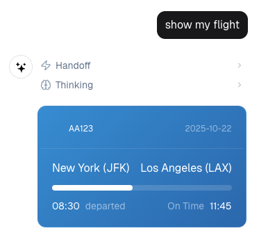

# Widgets

Widgets are interactive components that can be rendered in the chat interface, providing rich user experiences beyond text and images.

## Overview

The WebAgents widget system supports two distinct widget types:

| Type | Description | Creation | Rendering | Use Cases |
|------|-------------|----------|-----------|-----------|
| **WebAgents Widgets** | Custom HTML/JavaScript components | Code with `@widget` decorator | Sandboxed iframes | Interactive UIs, media players, forms, visualizations |
| **OpenAI ChatKit Widgets** | Widgets from OpenAI's tools | [OpenAI Widget Builder](https://widgets.chatkit.studio/) / [Agent Builder](https://platform.openai.com/agent-builder) | Direct React rendering | Structured layouts, data displays, simple interactions |

<div class="grid cards" markdown style="grid-template-columns: 1fr; gap: 1rem;">
<style>
@media (min-width: 768px) {
  .grid.cards { grid-template-columns: repeat(2, 1fr) !important; }
}
</style>

-   **WebAgents HTML/JS Widgets**

    ---

    

    Custom HTML/JavaScript components for maximum flexibility.

-   **OpenAI ChatKit Widgets**

    ---

    

    Created in [OpenAI's Widget Builder](https://widgets.chatkit.studio/), rendered by WebAgents.

</div>


## Widget Decorator

The `@widget` decorator is used for both widget types. It accepts the following parameters:

- **name** (optional): Override for widget name (defaults to function name)
- **description** (optional): Widget description for LLM awareness (defaults to docstring)
- **template** (optional): Path to Jinja2 template file (WebAgents only)
- **scope** (optional): Access control - `"all"`, `"owner"`, `"admin"`, or list of scopes
- **auto_escape** (optional, default=True): Automatically HTML-escape string arguments (WebAgents only)

## WebAgents Widgets

WebAgents widgets are custom HTML/JavaScript components rendered in sandboxed iframes. They provide maximum flexibility for interactive user interfaces.

### Basic Example

```python
from webagents import Skill, widget
from webagents.server.context.context_vars import Context

class MusicPlayerSkill(Skill):
    @widget(
        name="play_music",
        description="Display an interactive music player for a given track",
        scope="all"
        # auto_escape=True by default - arguments are automatically escaped!
    )
    async def play_music(
        self,
        song_url: str,
        title: str,
        artist: str = "Unknown Artist",
        context: Context = None
    ) -> str:
        """Create an interactive music player widget
        
        All string arguments are automatically HTML-escaped for security.
        No need for manual html.escape() calls!
        """
        
        # Create HTML content - arguments are already escaped!
        html_content = f"""<!DOCTYPE html>
<html>
<head>
    <script src="https://cdn.tailwindcss.com"></script>
</head>
<body class="bg-gray-900 p-4">
    <div class="max-w-md mx-auto bg-gray-800 rounded-lg p-6">
        <h2 class="text-white text-xl font-bold">{title}</h2>
        <p class="text-gray-400">{artist}</p>
        <audio controls class="w-full mt-4">
            <source src="{song_url}" type="audio/mpeg">
        </audio>
        <button 
            onclick="sendMessage('Play next song')" 
            class="bg-blue-600 text-white px-4 py-2 rounded mt-4 w-full">
            Next Song
        </button>
    </div>
    <script>
        function sendMessage(text) {{
            window.parent.postMessage({{
                type: 'widget_message',
                content: text
            }}, '*');
        }}
    </script>
</body>
</html>"""
        
        # Return wrapped in <widget> tags with kind="webagents"
        return f'<widget kind="webagents" id="music_player">{html_content}</widget>'
```

### Widget Format

WebAgents widgets must follow this format:

```python
return f'<widget kind="webagents" id="{widget_id}">{html_content}</widget>'
```

**Required attributes:**
- `kind="webagents"` - Identifies this as a WebAgents widget
- `id` - Unique identifier for the widget

**Optional attributes:**
- `data` - JSON metadata for state restoration (see Advanced Usage)

### Template Rendering

For complex widgets, use Jinja2 templates:

```python
from webagents import WidgetTemplateRenderer

renderer = WidgetTemplateRenderer(template_dir="widgets")

@widget(name="complex_widget", template="complex.html")
async def complex_widget(self, data: dict) -> str:
    html = renderer.render("complex.html", data)
    return f'<widget kind="webagents" id="complex">{html}</widget>'
```

For simple widgets, use inline HTML:

```python
@widget
async def simple_widget(self, text: str) -> str:
    html = f"<div class='p-4'>{text}</div>"  # Auto-escaped
    return f'<widget kind="webagents" id="simple">{html}</widget>'
```


### Styling

WebAgents widgets should use Tailwind CSS. Include the CDN in your HTML:

```html
<script src="https://cdn.tailwindcss.com"></script>
```

Or use the helper method:

```python
from webagents import WidgetTemplateRenderer

html = WidgetTemplateRenderer.inject_tailwind_cdn(my_html)
```

### Advanced: Widget Data Attribute

The optional `data` attribute allows you to pass structured metadata. Use cases:

- State restoration (playback position, volume, etc.)
- Analytics and logging
- Error recovery (fallback URLs)
- Dynamic configuration

**Backend - Adding Data:**

```python
import html
import json

@widget(name="music_player")
async def play_music(self, song_url: str, title: str, artist: str) -> str:
    html_content = f"""..."""  # Your widget HTML
    
    # Optional: Add metadata for state restoration/analytics
    widget_data = {
        'song_url': song_url,
        'title': title,
        'artist': artist,
        'timestamp': time.time()
    }
    
    # Escape JSON for HTML attribute (must use html.escape with quote=True)
    escaped_data = html.escape(json.dumps(widget_data), quote=True)
    
    return f'<widget kind="webagents" id="music_player" data="{escaped_data}">{html_content}</widget>'
```

**Frontend - Accessing Data:**

The widget receives data via postMessage (recommended) or iframe attribute (fallback).

```javascript
window.addEventListener('message', (event) => {
    if (event.data.type === 'widget_init') {
        const widgetData = event.data.data;
        // Use widgetData for state restoration, analytics, etc.
    }
});
```

**Example:**

```python
@widget(name="stateful_player")
async def stateful_player(self, song_url: str, last_position: float = 0.0) -> str:
    widget_data = {
        'song_url': song_url,
        'last_position': last_position  # Resume from where user left off
    }
    
    html_content = f"""
    <audio id="audio" src="{song_url}"></audio>
    <script>
        window.addEventListener('message', (e) => {{
            if (e.data.type === 'widget_init') {{
                const audio = document.getElementById('audio');
                audio.currentTime = e.data.data.last_position || 0;
                audio.play();
            }}
        }});
    </script>
    """
    
    escaped_data = html.escape(json.dumps(widget_data), quote=True)
    return f'<widget id="player" data="{escaped_data}">{html_content}</widget>'
```

### Security

#### Sandboxing

Widgets render in sandboxed iframes:

```typescript
<iframe sandbox="allow-scripts allow-same-origin" />
```

**Security features:**

- Isolated execution - no access to parent window
- No cookies/storage access
- Blob URLs - content served from memory
- Script execution allowed for interactivity
- Same-origin policy for styling and APIs

#### XSS Prevention

Widgets are **secure by default** with automatic HTML escaping:

- Auto-escaping enabled by default (`auto_escape=True`)
- No boilerplate needed - variables are automatically safe
- Blob URL rendering prevents inline XSS
- Escape hatch: `auto_escape=False` (use with caution)

**Secure by default:**
```python
@widget(name="safe_widget")
async def safe_widget(self, user_input: str) -> str:
    return f'<widget><div>{user_input}</div></widget>'  # Auto-escaped
```

#### Communication

Widgets communicate with the chat interface via postMessage API:

```javascript
window.parent.postMessage({
    type: 'widget_message',
    content: 'User message text'
}, '*');
```

**How it works:**
1. Widget sends `widget_message` event
2. Frontend validates message structure
3. Content appended as user message
4. Agent processes the new message

### Browser Detection

WebAgents widgets are only available to browser clients. The system detects browsers via User-Agent headers (Mozilla, Chrome, Safari, Firefox, Edge).

OpenAI ChatKit widgets may work in more contexts since they don't require iframe support.

## OpenAI ChatKit Widgets

ChatKit widgets are created using OpenAI's [Widget Builder](https://widgets.chatkit.studio/) and [Agent Builder](https://platform.openai.com/agent-builder). WebAgents provides full rendering support for widgets created in these tools.

**How it works:**
1. Create widgets using [OpenAI's Widget Builder](https://widgets.chatkit.studio/)
2. Build agents with [OpenAI's Agent Builder](https://platform.openai.com/agent-builder)
3. WebAgents renders the widget JSON structures from OpenAI's tools
4. Full compatibility with all OpenAI ChatKit components

**Current Status:** WebAgents provides **full rendering support** for all OpenAI ChatKit components. See [component support](#supported-components) below.

### Rendering OpenAI Widgets

WebAgents can render widgets created in OpenAI's tools by returning the widget JSON:

```python
import json
from webagents import widget

@widget(name="openai_widget")
async def render_openai_widget(self, widget_json: str, context: Context = None) -> str:
    """Render a widget created in OpenAI's Widget Builder
    
    Args:
        widget_json: JSON structure from OpenAI's Widget Builder
    """
    # Widget JSON from OpenAI's tools can be passed through directly
    return f'<widget kind="openai">{widget_json}</widget>'
```

### Example Widget Structure

If you need to generate widget JSON programmatically (compatible with OpenAI's format):

```python
import json
from webagents import widget

@widget(name="info_card")
async def info_card(self, title: str, description: str) -> str:
    """Display an informational card (OpenAI ChatKit compatible)"""
    
    widget_structure = {
        "$kind": "card",
        "content": [
            {
                "$kind": "text",
                "content": title,
                "size": "lg",
                "weight": "bold"
            },
            {
                "$kind": "text",
                "content": description
            }
        ]
    }
    
    return f'<widget kind="openai">{json.dumps(widget_structure)}</widget>'
```

### Widget Format

OpenAI ChatKit widgets use this format:

```python
return f'<widget kind="openai">{widget_json}</widget>'
```

**Required attributes:**
- `kind="openai"` - Identifies this as an OpenAI ChatKit widget

**Sources:**
- JSON from [OpenAI's Widget Builder](https://widgets.chatkit.studio/)
- Widget definitions from [OpenAI's Agent Builder](https://platform.openai.com/agent-builder)
- Programmatically generated JSON (must follow OpenAI ChatKit format)

### Supported Components

WebAgents renders all components from [OpenAI's Widget Builder](https://widgets.chatkit.studio/):

| Category | Component | Status | Description |
|----------|-----------|--------|-------------|
| **Layout** | `Card` | ✅ Supported | Container with optional styling |
| | `Box` | ✅ Supported | Flexible container |
| | `Row` | ✅ Supported | Horizontal layout |
| | `Col` | ✅ Supported | Vertical layout |
| | `Spacer` | ✅ Supported | Flexible space |
| | `Divider` | ✅ Supported | Visual separator |
| **Typography** | `Text` | ✅ Supported | Text content with formatting |
| | `Caption` | ✅ Supported | Small text captions |
| | `Title` | ✅ Supported | Large heading text |
| | `Label` | ✅ Supported | Label text |
| | `Markdown` | ✅ Supported | Markdown content |
| **Content** | `Image` | ✅ Supported | Display images |
| | `Icon` | ✅ Supported | Display icons (emoji/unicode) |
| | `Chart` | ✅ Supported | Bar and line chart visualizations |
| | `Badge` | ✅ Supported | Status badges with variants |
| **Controls** | `Button` | ✅ Supported | Interactive buttons |
| | `DatePicker` | ✅ Supported | Date selection input |
| | `Select` | ✅ Supported | Dropdown selection |
| | `Checkbox` | ✅ Supported | Checkbox input |
| | `RadioGroup` | ✅ Supported | Radio button group |
| | `Form` | ✅ Supported | Form container |
| **Other** | `Transition` | ✅ Supported | Animated transitions |

**Create Widgets:** Use [OpenAI's Widget Builder](https://widgets.chatkit.studio/) to create widgets visually, then WebAgents will render them. For detailed component specifications, see the [OpenAI Widget Builder](https://widgets.chatkit.studio/) and [OpenAI Agent Builder](https://platform.openai.com/agent-builder).

## Choosing Between Widget Types

| Choose | When You Need |
|---------|---------------|
| **WebAgents Widgets** | Custom HTML/JS interactivity, complex layouts, full control over rendering |
| **OpenAI ChatKit Widgets** | Visual widget creation with [OpenAI's tools](https://widgets.chatkit.studio/), standard UI patterns, compatibility with OpenAI agents |
| **Tools** | Data fetching/processing, no UI, text-based output |

## Troubleshooting

### Widget Not Appearing

- Verify User-Agent is from a browser
- Check `<widget>` tags are properly formatted
- Ensure `kind` attribute is correct

### postMessage Not Working

- Verify `type: 'widget_message'` is set
- Check sandbox allows `allow-scripts`
- Ensure target is `'*'` for blob URLs

### Styling Issues

- Confirm Tailwind CDN is included
- Check for conflicting styles
- Test with `colorScheme: 'normal'` on iframe

### Debug Logging

**Backend:**
```python
self.logger.debug(f"🎨 Widget registered: {widget_name}")
```

**Frontend:**
```javascript
console.log('[SkillWidget] Message from widget:', message);
```

## API Reference

### Decorator

```python
@widget(
    name: Optional[str] = None,
    description: Optional[str] = None,
    template: Optional[str] = None,
    scope: Union[str, List[str]] = "all",
    auto_escape: bool = True
)
```

### WidgetTemplateRenderer

Jinja2 template renderer for WebAgents HTML widgets.

```python
class WidgetTemplateRenderer:
    def __init__(self, template_dir: Optional[str] = None)
    def render(self, template_name: str, context: Dict[str, Any]) -> str
    def render_inline(self, html_string: str, context: Dict[str, Any]) -> str
    
    @staticmethod
    def escape_data(data: Any) -> str
    
    @staticmethod
    def inject_tailwind_cdn(html_content: str) -> str
```


### BaseAgent Methods

```python
def get_all_widgets(self) -> List[Dict[str, Any]]
def register_widget(self, widget_func: Callable, source: str = "manual", scope: Union[str, List[str]] = None)
def _is_browser_request(self, context=None) -> bool
```

## Related Documentation

- [Tools](tools.md) - Simple tool-based interactions
- [Handoffs](handoffs.md) - Agent delegation
- [Skills](../skills/overview.md) - Skill development

