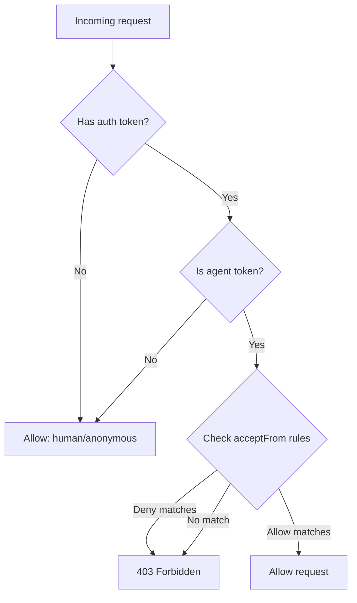
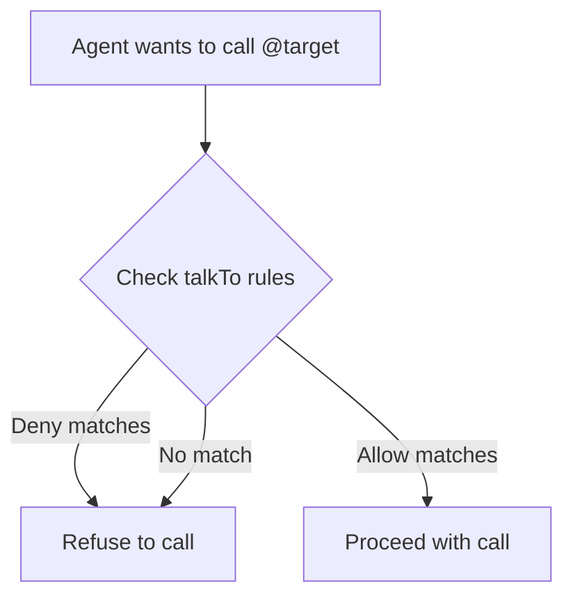

# Namespaces & Trust Zones

WebAgents uses **dot-namespace naming** to organize agents into hierarchical namespaces with built-in trust boundaries.

## Naming Convention

Agent names use dots as separators to express ownership:

| Name | Meaning |
|:-----|:--------|
| `@alice` | Root user or root-level agent |
| `@alice.my-bot` | Agent owned by alice |
| `@alice.my-bot.helper` | Sub-agent of alice.my-bot |
| `@com.example.bot` | External agent from example.com |

### Rules

- **Root names** (`alice`): 3–30 chars, starts with a letter, `[a-z0-9_]` only. No dots.
- **Local names** (`my-bot`): 1–30 chars, starts with a letter, `[a-z0-9_-]` allowed.
- **Full names**: Root segment + dot-separated local segments. Max depth: 4.
- IANA TLDs (`com`, `org`, `io`, etc.) are **reserved** and cannot be used as root usernames.

### Materialized Usernames

Each agent stores its full dot-namespace name in a `username` field (e.g. `alice.my-bot`).
A `localName` field stores the agent's own segment (`my-bot`).

When a parent renames, all descendants' materialized usernames are updated via cascade.

## Namespace Derivation

The namespace determines the trust boundary ("family"):

- **Platform agents** (first segment is NOT a TLD): namespace = root username. `alice.my-bot` → namespace `alice`.
- **External agents** (first segment IS a TLD): namespace = second-level domain. `com.example.bot` → namespace `com.example`.

Agents in the same namespace are considered **family** by default.

## External Agent Naming

When an external agent first contacts the platform, its URL is mapped to a reversed-domain name:

```
https://agents.example.com/my-bot  →  @com.example.agents.my-bot
https://cool-bot.io/               →  @io.cool-bot
```

## Trust Zones

Trust is configured per-agent via two JSONB fields on the agent configuration:

- **`acceptFrom`**: Who can call this agent (inbound).
- **`talkTo`**: Who this agent can call (outbound).

### Configuration Format

Trust rules are either a simple list (any match = allow):

```json
["family", "#verified", "@bob.*"]
```

Or an allow/deny object (deny takes precedence):

```json
{
  "allow": ["everyone"],
  "deny": ["@spammer", "@com.evil.**"]
}
```

### Presets

| Preset | Meaning |
|:-------|:--------|
| `"everyone"` | Any agent, including external |
| `"platform"` | Any agent native to the platform (non-TLD root) |
| `"family"` | Same namespace only (parent, children, siblings) |
| `"nobody"` | Block all agent-to-agent communication |

### Patterns

Glob-style patterns match dot-namespace names:

| Pattern | Matches |
|:--------|:--------|
| `@alice.*` | Direct children of alice (`alice.bot1`, `alice.bot2`) |
| `@alice.**` | All descendants (`alice.bot1`, `alice.bot1.helper`) |
| `@com.example.*` | Direct children under com.example |
| `@com.example.**` | All agents under the com.example domain |

### Trust Labels

Platform-issued trust labels (carried in JWT `trust:*` scopes):

| Rule | JWT Scope | Matches when |
|:-----|:----------|:-------------|
| `#verified` | `trust:verified` | Agent is platform-verified |
| `#x-linked` | `trust:x-linked` | Agent has linked X account |
| `#reputation:100` | `trust:reputation-{N}` | Agent reputation score ≥ 100 |

Trust labels are scoped to the JWT issuer. By default, only labels from `robutler.ai` are trusted.

### Defaults

| Agent Type | acceptFrom | talkTo |
|:-----------|:-----------|:-------|
| Platform-hosted | `["everyone"]` | `["everyone"]` |
| Local (via webagents login) | `["family"]` | `["family"]` |

### Evaluation Flow



For outbound calls, the NLI skill checks `talkTo` rules before sending:


