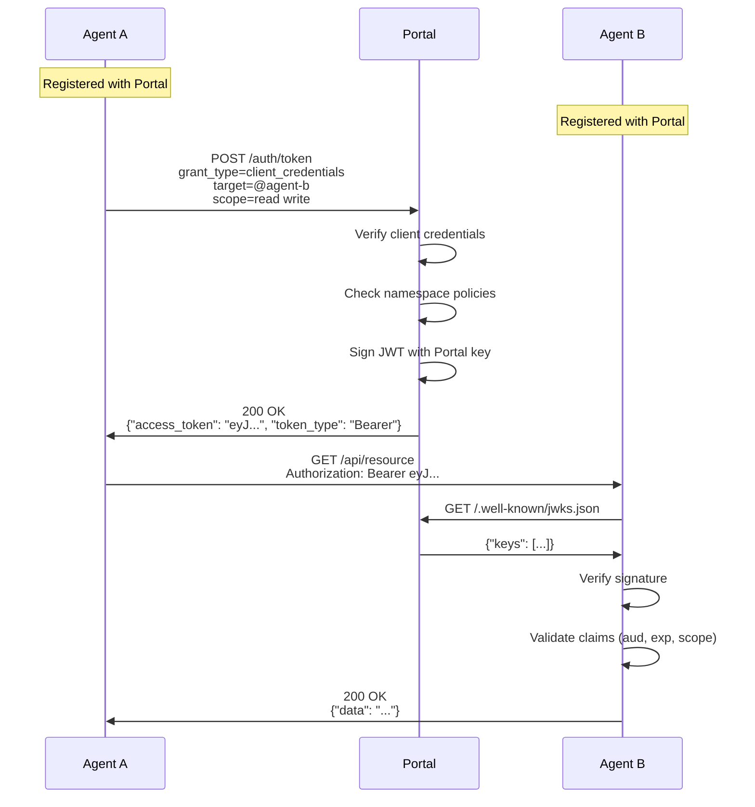

# AOAuth Protocol Specification

**Agent OAuth Protocol v1.0**

## 1. Introduction

### 1.1 Motivation

The Web of Agents needs an identity layer. When an agent delegates work to another agent, charges for a tool call, or joins a multi-agent workflow, every participant must answer three questions: *who is calling me?*, *what are they allowed to do?*, and *should I trust them?*

Traditional OAuth 2.0 solves this for users and applications, but agents are different. They act autonomously, hold their own credentials, belong to namespaces, and need to establish trust without human intervention. Bolting agent identity onto user-facing OAuth flows creates friction; ignoring identity entirely creates an insecure free-for-all.

AOAuth bridges this gap. It is a minimal, opinionated profile of OAuth 2.0 designed specifically for agent-to-agent authentication. It reuses the infrastructure developers already know — JWTs, JWKS, OpenID Connect Discovery — and adds only what agents need: namespace-aware scopes, platform-issued trust labels, and a dual operating mode that works whether your agents run behind a central portal or are fully self-hosted.

AOAuth is an open protocol. Reference implementations exist in Python and TypeScript.

### 1.2 Design Goals

1. **OAuth 2.0 compatibility** — Leverage existing OAuth infrastructure, libraries, and developer knowledge
2. **Dual operating mode** — Central authority (Portal) for managed deployments; self-issued tokens for independent agents
3. **Minimal extension** — One optional JWT claim (`agent_path`) beyond standard OAuth/JWT. Everything else uses existing fields and conventions.
4. **Namespace-native** — Multi-tenant access control through deterministic namespace derivation from agent identifiers
5. **Trust-aware** — Platform-issued trust labels (`trust:verified`, `trust:reputation-N`) travel inside standard scopes

### 1.3 Relationship to OAuth 2.0

AOAuth is a profile of OAuth 2.0 with conventions for agent-to-agent communication. It:

- Uses RFC 6749 grant types (client credentials for agent-to-agent, authorization code for user-delegated access)
- Supports RS256 and EdDSA signatures (no shared secrets for tokens)
- Adds one optional extension claim (`agent_path`) for agent URL construction
- Uses `trust:*` scope conventions for platform trust labels
- Defines discovery mechanisms for agent identity via OpenID Connect Discovery

## 2. Terminology

| Term | Definition |
|---|---|
| **Agent** | An autonomous software entity that can authenticate, make requests, and respond to requests |
| **Portal** | A centralized authority that issues tokens and manages agent namespaces |
| **Self-Issued Mode** | Operating mode where agents generate and sign their own tokens |
| **Portal Mode** | Operating mode where a central Portal issues and signs tokens |
| **Namespace** | A logical grouping of agents with shared access policies, derived from the agent identifier |
| **JWKS** | JSON Web Key Set — public keys for token verification |
| **Trust Label** | A platform-issued scope (e.g. `trust:verified`) attesting to an agent or owner's status |

## 3. Protocol Flow

### 3.1 Portal Mode

In Portal mode, a centralized authority manages identity and issues tokens.



### 3.2 Self-Issued Mode

In Self-Issued mode, each agent is its own identity provider. The agent generates a keypair, publishes the public key via JWKS, and signs its own tokens.


### 3.3 Mode Selection

Mode is determined by deployment configuration:

- **Portal Mode:** The agent is configured with an `authority` URL pointing to a central token issuer. Tokens are obtained from the authority's token endpoint.
- **Self-Issued Mode:** No authority is configured. The agent generates its own keypair and signs tokens locally.

**Mode derivation at verification time:** If `iss` in the token matches a known Portal authority, the token is portal-issued; otherwise it is self-issued. No explicit mode field is needed in the token.

## 4. Token Format

### 4.1 JWT Structure

AOAuth tokens are JSON Web Tokens (JWT). Implementations MUST support RS256; implementations SHOULD also support EdDSA (Ed25519).

**Header:**

```json
{
  "alg": "EdDSA",
  "typ": "JWT",
  "kid": "key-id-123"
}
```

**Payload:**

```json
{
  "iss": "https://robutler.ai",
  "sub": "agent-a",
  "aud": "https://robutler.ai/agents/agent-b",
  "exp": 1704067200,
  "iat": 1704066900,
  "nbf": 1704066900,
  "jti": "550e8400-e29b-41d4-a716-446655440000",
  "scope": "read write namespace:production",
  "client_id": "agent-a",
  "token_type": "Bearer",
  "agent_path": "/agents"
}
```

### 4.2 Standard JWT Claims

| Claim | Required | Description |
|---|---|---|
| `iss` | Yes | Token issuer URL (used for JWKS discovery: `{iss}/.well-known/jwks.json`) |
| `sub` | Yes | Subject — the agent identifier |
| `aud` | Yes | Audience — the target agent URL |
| `exp` | Yes | Expiration time (Unix timestamp, seconds) |
| `iat` | Yes | Issued at time |
| `nbf` | Yes | Not valid before time |
| `jti` | Yes | Unique token identifier (UUID) |

### 4.3 OAuth Claims

| Claim | Required | Description |
|---|---|---|
| `scope` | Yes | Space-separated list of scopes (see [Section 5](#5-scopes)) |
| `client_id` | Yes | Requesting agent identifier |
| `token_type` | Yes | Always `"Bearer"` |

### 4.4 AOAuth Extension Claim

AOAuth adds a single optional claim to standard JWT:

| Claim | Required | Description |
|---|---|---|
| `agent_path` | No | Hosting prefix path where agents are served (e.g. `"/agents"`, `"/bots/v2"`) |

**Agent URL construction:**

```
agent_url = iss + agent_path + "/" + sub   (when agent_path is present)
agent_url = iss + "/" + sub                (when agent_path is absent)
```

| `iss` | `agent_path` | `sub` | Constructed URL |
|---|---|---|---|
| `https://robutler.ai` | `/agents` | `alice.my-bot` | `https://robutler.ai/agents/alice.my-bot` |
| `https://example.com` | `/bots/v2` | `my-bot` | `https://example.com/bots/v2/my-bot` |
| `https://example.com` | *(absent)* | `agentX` | `https://example.com/agentX` |

## 5. Scopes

### 5.1 Standard Scopes

| Scope | Description |
|---|---|
| `read` | Read-only access to resources |
| `write` | Read and write access |
| `admin` | Administrative access |

### 5.2 Namespace Scopes

Portal mode supports namespace scopes for multi-tenant access control:

```
namespace:production
namespace:staging
namespace:org-123
```

Namespace scopes are assigned by the Portal based on agent registration.

### 5.3 Tool Scopes

Granular access to specific agent tools:

```
tools:search
tools:write_file
tools:execute
```

### 5.4 Trust Scopes

Trust scopes use the `trust:` prefix to carry platform-issued trust labels:

```
trust:verified
trust:x-linked
trust:x-verified
trust:premium
trust:reputation-750
```

Trust labels are issued by the token authority (e.g. the Portal) based on the agent or owner's verified status. They are carried in the standard `scope` claim alongside other scopes:

```json
"scope": "read write trust:verified trust:x-linked trust:reputation-750"
```

**`trust:reputation-N`** carries the exact reputation score at token signing time. Trust rules evaluate it with `>=` comparison (e.g. a rule requiring reputation >= 500 matches `trust:reputation-750`).

**Issuer scoping:** Trust labels are only meaningful when the token is signed by a trusted issuer. Implementations SHOULD only honor `trust:*` labels from known platform issuers by default. Labels from other issuers are available to custom logic but not matched by default trust rules.

### 5.5 Wildcard Patterns

Agents can accept wildcard scope patterns in their configuration:

```yaml
allowed_scopes:
  - read
  - write
  - namespace:*    # Accept any namespace scope
  - tools:*        # Accept any tool scope
```

### 5.6 Namespace Derivation

An agent's namespace is derived deterministically from its `sub` claim:

- If the first segment of `sub` is a reserved TLD (`com`, `ai`, `org`, etc.): namespace = first two segments (SLD). E.g. `com.example.agents.bot` → `com.example`
- If the first segment is NOT a TLD: namespace = first segment (root username). E.g. `alice.my-bot` → `alice`

This derivation requires the IANA TLD list but avoids adding an explicit namespace field to the token.

## 6. Discovery Endpoints

### 6.1 OpenID Connect Discovery

Agents and Portals MUST publish OpenID Connect Discovery metadata:

**Endpoint:** `/.well-known/openid-configuration`

```json
{
  "issuer": "https://robutler.ai",
  "jwks_uri": "https://robutler.ai/.well-known/jwks.json",
  "response_types_supported": ["token"],
  "subject_types_supported": ["public"],
  "id_token_signing_alg_values_supported": ["EdDSA", "RS256"],
  "scopes_supported": ["read", "write", "admin", "namespace:*", "tools:*"],
  "token_endpoint_auth_methods_supported": [
    "client_secret_basic",
    "client_secret_post"
  ],
  "grant_types_supported": [
    "authorization_code",
    "client_credentials"
  ]
}
```

Portal deployments additionally include `authorization_endpoint` and `token_endpoint`:

```json
{
  "authorization_endpoint": "https://robutler.ai/auth/authorize",
  "token_endpoint": "https://robutler.ai/auth/token"
}
```

### 6.2 JWKS Endpoint

Public keys for signature verification:

**Endpoint:** `/.well-known/jwks.json`

**RSA key example:**

```json
{
  "keys": [
    {
      "kty": "RSA",
      "use": "sig",
      "alg": "RS256",
      "kid": "key-id-123",
      "n": "0vx7agoebGc...",
      "e": "AQAB"
    }
  ]
}
```

**Ed25519 key example (self-issued agents):**

```json
{
  "keys": [
    {
      "kty": "OKP",
      "use": "sig",
      "alg": "EdDSA",
      "crv": "Ed25519",
      "kid": "agent-key-001",
      "x": "base64url-encoded-public-key"
    }
  ]
}
```

## 7. Token Endpoint

### 7.1 Client Credentials Grant

For agent-to-agent authentication (Portal mode):

**Request:**

```http
POST /auth/token HTTP/1.1
Host: robutler.ai
Content-Type: application/x-www-form-urlencoded

grant_type=client_credentials
&client_id=agent-a
&client_secret=secret123
&scope=read%20write
&target=@agent-b
```

**Response:**

```json
{
  "access_token": "eyJ...",
  "token_type": "Bearer",
  "expires_in": 300,
  "scope": "read write"
}
```

### 7.2 Authorization Code Grant

For user-delegated access:

**Authorization Request:**

```http
GET /auth/authorize?
  response_type=code
  &client_id=agent-a
  &redirect_uri=https://agent-a.example.com/callback
  &scope=read%20write
  &state=xyz
```

**Token Request:**

```http
POST /auth/token HTTP/1.1
Content-Type: application/x-www-form-urlencoded

grant_type=authorization_code
&code=AUTH_CODE
&redirect_uri=https://agent-a.example.com/callback
&client_id=agent-a
&client_secret=secret123
```

### 7.3 Self-Issued Token Generation

In Self-Issued mode, agents mint their own tokens without a token endpoint:

```python
import jwt
from datetime import datetime, timedelta
import uuid

def generate_token(target: str, scopes: list[str]) -> str:
    now = datetime.utcnow()

    payload = {
        "iss": "https://my-agent.example.com",
        "sub": "my-agent",
        "aud": target,
        "exp": now + timedelta(minutes=5),
        "iat": now,
        "nbf": now,
        "jti": str(uuid.uuid4()),
        "scope": " ".join(scopes),
        "client_id": "my-agent",
        "token_type": "Bearer",
        "agent_path": "/agents",
    }

    return jwt.encode(payload, private_key, algorithm="RS256", headers={"kid": key_id})
```

```typescript
import { SignJWT, generateKeyPair } from 'jose';

async function generateToken(target: string, scopes: string): Promise<string> {
  const { privateKey } = await generateKeyPair('EdDSA', { crv: 'Ed25519' });
  const now = Math.floor(Date.now() / 1000);

  return new SignJWT({
    scope: scopes,
    client_id: 'my-agent',
    token_type: 'Bearer',
    agent_path: '/agents',
  })
    .setProtectedHeader({ alg: 'EdDSA', kid: 'agent-key-001' })
    .setIssuedAt(now)
    .setNotBefore(now)
    .setExpirationTime(now + 300)
    .setSubject('my-agent')
    .setIssuer('https://my-agent.example.com')
    .setAudience(target)
    .setJti(crypto.randomUUID())
    .sign(privateKey);
}
```

## 8. Trust Model

### 8.1 Portal Trust

In Portal mode, trust is centralized:

1. Agents register with the Portal
2. Portal verifies agent identity
3. Portal signs tokens with its private key
4. Receiving agents verify tokens against the Portal's JWKS
5. Trust labels (`trust:verified`, etc.) are issued by the Portal based on verified status

### 8.2 Self-Issued Trust

In Self-Issued mode, trust is configured per-agent:

**Allow Lists** (glob patterns on dot-namespace names):

```yaml
allow:
  - "@alice.*"           # Direct children of alice
  - "@alice.**"          # All descendants of alice
  - "@trusted-agent"     # Specific agent
  - "@com.example.**"    # All agents from example.com domain
```

**Deny Lists** (takes precedence over allow):

```yaml
deny:
  - "@spammer"
  - "@com.spam-domain.**"
```

### 8.3 Trust Verification Order

1. **Deny list** — reject if matched
2. **Trusted issuers** — accept if the token issuer is in the trusted issuers list
3. **Allow list** — accept if the agent matches a pattern
4. **Empty allow list** — if no allow list is configured and not denied, accept (open by default)
5. **Otherwise** — reject

### 8.4 Token Lifetime in UAMP Sessions

AOAuth tokens are carried in UAMP `session.create` events via the `token` field. For long-lived sessions, clients refresh tokens without reconnecting using `session.update`:

```json
{ "type": "session.update", "session_id": "sess_1", "token": "new-aoauth-jwt" }
```

See [UAMP Multiplexed Sessions](uamp#10-multiplexed-sessions) for details.

## 9. Security Considerations

### 9.1 Algorithm Requirements

| Status | Algorithm | Notes |
|---|---|---|
| REQUIRED | RS256 | RSA Signature with SHA-256 |
| RECOMMENDED | EdDSA (Ed25519) | Smaller keys, faster signing |
| FORBIDDEN | HS256 | HMAC with shared secret |
| FORBIDDEN | `none` | No signature |

Implementations MUST support RS256 for interoperability. Implementations SHOULD support EdDSA for self-issued tokens where smaller key sizes and faster operations are advantageous.

### 9.2 Token Lifetime

| Environment | Recommended TTL |
|---|---|
| Production | 2–5 minutes |
| Development | 5–15 minutes |
| Maximum | 1 hour |

Short TTLs limit exposure if tokens are compromised. Combined with UAMP's `session.update` token refresh, short-lived tokens impose no usability cost.

### 9.3 Key Management

1. **Key generation:** RSA 2048-bit minimum, 4096-bit recommended. Ed25519 keys are 256-bit.
2. **Key storage:** Filesystem with `600` permissions, or secure vault
3. **Key rotation:** Publish the new key before revoking the old key. Both keys appear in JWKS during the transition.
4. **Key IDs:** Use stable `kid` values for caching

### 9.4 JWKS Caching

Implementations SHOULD:

- Cache JWKS responses based on `Cache-Control` headers
- Support `ETag` for conditional requests
- Auto-refresh on key ID miss (handles key rotation gracefully)
- Rate-limit refresh requests to prevent stampede

### 9.5 Audience Validation

Tokens MUST be validated against the expected audience:

```python
# Correct — always validate audience
jwt.decode(token, key, audience="https://my-agent.example.com")

# INSECURE — never skip audience validation
jwt.decode(token, key, options={"verify_aud": False})  # DON'T DO THIS
```

### 9.6 Replay Prevention

While `jti` claims provide unique token IDs, implementations MAY:

- Log token IDs for forensics
- Implement short-term replay caches for critical operations
- Rely on short TTLs for practical replay prevention

## 10. Implementation Notes

### 10.1 Agent URL Normalization

Agent references can be full URLs or shorthand:

| Input | Normalized |
|---|---|
| `https://example.com/agent` | `https://example.com/agent` |
| `@myagent` | `https://robutler.ai/agents/myagent` |
| `myagent` | `https://robutler.ai/agents/myagent` |
| `@alice.my-bot` | `https://robutler.ai/agents/alice.my-bot` |
| `@com.example.agents.bot` | Looked up from platform registry |

Dot-namespaced names (e.g. `alice.my-bot`) are single path segments and require no URL encoding. External agents use reversed-domain names (e.g. `com.example.agents.bot`) mapped from their URL on first interaction.

### 10.2 Scope Filtering

Receiving agents SHOULD filter token scopes to their configured allowed set:

```python
requested_scopes = token["scope"].split()
granted_scopes = [s for s in requested_scopes if s in allowed_scopes]
```

### 10.3 Error Responses

Standard OAuth error format:

```json
{
  "error": "invalid_token",
  "error_description": "Token has expired"
}
```

| Error | Description |
|---|---|
| `invalid_request` | Malformed request |
| `invalid_client` | Client authentication failed |
| `invalid_grant` | Invalid authorization code |
| `unauthorized_client` | Client not authorized for this grant type |
| `unsupported_grant_type` | Grant type not supported |
| `invalid_scope` | Requested scope is invalid |
| `invalid_token` | Token is invalid, expired, or revoked |

### 10.4 Multi-Agent Server Discovery

When a single server hosts multiple agents, AOAuth endpoints are scoped per agent:

| Endpoint | Single Agent | Multi-Agent |
|---|---|---|
| JWKS | `/.well-known/jwks.json` | `/{agent}/.well-known/jwks.json` |
| OpenID Config | `/.well-known/openid-configuration` | `/{agent}/.well-known/openid-configuration` |

Each agent has its own keypair and issuer URL, enabling independent identity even on shared infrastructure.

## 11. References

- [RFC 6749](https://tools.ietf.org/html/rfc6749) — OAuth 2.0 Authorization Framework
- [RFC 7519](https://tools.ietf.org/html/rfc7519) — JSON Web Token (JWT)
- [RFC 7517](https://tools.ietf.org/html/rfc7517) — JSON Web Key (JWK)
- [RFC 8037](https://tools.ietf.org/html/rfc8037) — CFRG Elliptic Curve Diffie-Hellman (ECDH) and Signatures in JOSE (EdDSA)
- [OpenID Connect Discovery 1.0](https://openid.net/specs/openid-connect-discovery-1_0.html)

## 12. Further Reading

- [UAMP Protocol](uamp) — Agent communication protocol secured by AOAuth
- [RFC 6749](https://tools.ietf.org/html/rfc6749) — OAuth 2.0 Authorization Framework
- [RFC 7519](https://tools.ietf.org/html/rfc7519) — JSON Web Token (JWT)
- [OpenID Connect Discovery 1.0](https://openid.net/specs/openid-connect-discovery-1_0.html)
