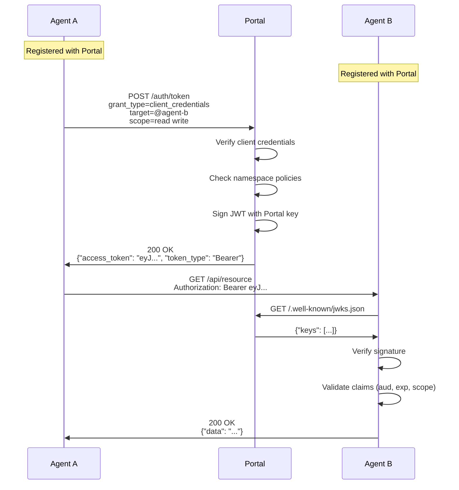
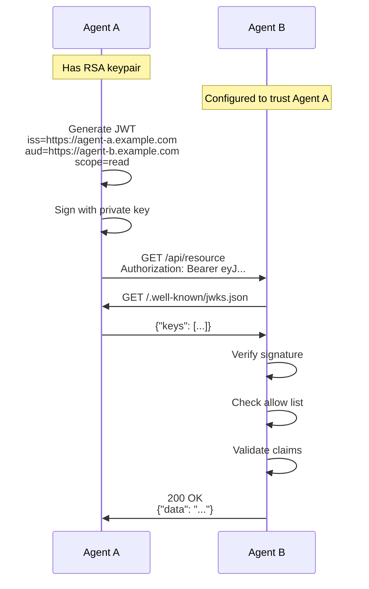

# AOAuth Protocol Specification

**Agent OAuth Protocol v1.0**

## Abstract

AOAuth (Agent OAuth) is an extension of the OAuth 2.0 authorization framework designed specifically for agent-to-agent authentication and authorization. This document specifies the protocol flow, token format, and security considerations for implementing AOAuth in distributed agent systems.

## 1. Introduction

### 1.1 Purpose

Traditional OAuth 2.0 was designed for user-to-application authorization. AOAuth extends this model to support machine-to-machine authentication between autonomous software agents, providing:

- **Identity verification** between agents
- **Scope-based access control** for agent capabilities
- **Namespace membership** for multi-tenant environments
- **Federated trust** across organizational boundaries

### 1.2 Design Goals

1. **OAuth 2.0 Compatibility** - Leverage existing OAuth infrastructure
2. **Decentralized Support** - Enable self-issued tokens without central authority
3. **Minimal Extension** - Add only necessary claims for agent use cases
4. **Security First** - Require strong cryptographic primitives

### 1.3 Relationship to OAuth 2.0

AOAuth is a profile of OAuth 2.0 with extensions. It:

- Uses RFC 6749 grant types (client credentials, authorization code)
- Requires RS256 signatures (no shared secrets for tokens)
- Adds agent-specific claims to JWT tokens
- Defines discovery mechanisms for agent identity

## 2. Terminology

| Term | Definition |
|------|------------|
| **Agent** | An autonomous software entity that can authenticate, make requests, and respond to requests |
| **Portal** | A centralized authority that issues tokens and manages agent namespaces |
| **Self-Issued Mode** | Operating mode where agents generate and sign their own tokens |
| **Portal Mode** | Operating mode where a central Portal issues and signs tokens |
| **Namespace** | A logical grouping of agents with shared access policies |
| **JWKS** | JSON Web Key Set - a set of public keys for token verification |

## 3. Protocol Flow

### 3.1 Portal Mode

In Portal mode, a centralized authority (Portal) manages identity and issues tokens.



### 3.2 Self-Issued Mode

In Self-Issued mode, each agent is its own identity provider.



### 3.3 Mode Selection

Mode is determined by configuration:

```yaml
# Portal Mode (authority is set)
skills:
  auth:
    authority: "https://robutler.ai"

# Self-Issued Mode (no authority)
skills:
  auth:
    base_url: "https://my-agent.example.com"
```

## 4. Token Format

### 4.1 JWT Structure

AOAuth tokens are JSON Web Tokens (JWT) with RS256 signatures.

**Header:**
```json
{
  "alg": "RS256",
  "typ": "JWT",
  "kid": "key-id-123"
}
```

**Payload:**
```json
{
  "iss": "https://robutler.ai",
  "sub": "agent-a",
  "aud": "https://robutler.ai/agents/agent-b",
  "exp": 1704067200,
  "iat": 1704066900,
  "nbf": 1704066900,
  "jti": "550e8400-e29b-41d4-a716-446655440000",
  "scope": "read write namespace:production",
  "client_id": "agent-a",
  "token_type": "Bearer",
  "aoauth": {
    "version": "1.0",
    "mode": "portal",
    "agent_url": "https://robutler.ai/agents/agent-a"
  }
}
```

### 4.2 Standard Claims

| Claim | Required | Description |
|-------|----------|-------------|
| `iss` | Yes | Token issuer (Portal URL or agent URL) |
| `sub` | Yes | Subject (agent identifier) |
| `aud` | Yes | Audience (target agent URL) |
| `exp` | Yes | Expiration time (Unix timestamp) |
| `iat` | Yes | Issued at time |
| `nbf` | Yes | Not before time |
| `jti` | Yes | Unique token identifier (UUID) |

### 4.3 OAuth Claims

| Claim | Required | Description |
|-------|----------|-------------|
| `scope` | Yes | Space-separated list of scopes |
| `client_id` | Yes | Requesting agent identifier |
| `token_type` | Yes | Always "Bearer" |

### 4.4 AOAuth Extension Claims

| Claim | Required | Description |
|-------|----------|-------------|
| `aoauth.version` | Yes | Protocol version (e.g., "1.0") |
| `aoauth.mode` | Yes | "portal" or "self" |
| `aoauth.agent_url` | No | Full URL of the requesting agent |

## 5. Scopes

### 5.1 Standard Scopes

| Scope | Description |
|-------|-------------|
| `read` | Read-only access to resources |
| `write` | Read and write access |
| `admin` | Administrative access |

### 5.2 Namespace Scopes

Portal mode supports namespace scopes for multi-tenant access control:

```
namespace:production
namespace:staging
namespace:org-123
```

Namespace scopes are assigned by the Portal based on agent registration.

### 5.3 Tool Scopes

Granular access to specific agent tools:

```
tools:search
tools:write_file
tools:execute
```

### 5.4 Wildcard Patterns

Agents can accept wildcard scope patterns:

```yaml
allowed_scopes:
  - read
  - write
  - namespace:*    # Accept any namespace scope
  - tools:*        # Accept any tool scope
```

## 6. Discovery Endpoints

### 6.1 OpenID Configuration

Agents and Portals MUST publish OpenID Connect Discovery metadata:

**Endpoint:** `/.well-known/openid-configuration`

```json
{
  "issuer": "https://robutler.ai",
  "authorization_endpoint": "https://robutler.ai/auth/authorize",
  "token_endpoint": "https://robutler.ai/auth/token",
  "jwks_uri": "https://robutler.ai/.well-known/jwks.json",
  "response_types_supported": ["code", "token"],
  "subject_types_supported": ["public"],
  "id_token_signing_alg_values_supported": ["RS256"],
  "scopes_supported": ["read", "write", "namespace:*"],
  "token_endpoint_auth_methods_supported": [
    "client_secret_basic",
    "client_secret_post"
  ],
  "grant_types_supported": [
    "authorization_code",
    "client_credentials"
  ],
  "aoauth": {
    "version": "1.0",
    "mode": "portal",
    "agent_id": "my-agent"
  }
}
```

### 6.2 JWKS Endpoint

Public keys for signature verification:

**Endpoint:** `/.well-known/jwks.json`

```json
{
  "keys": [
    {
      "kty": "RSA",
      "use": "sig",
      "alg": "RS256",
      "kid": "key-id-123",
      "n": "0vx7agoebGc...",
      "e": "AQAB"
    }
  ]
}
```

## 7. Token Endpoint

### 7.1 Client Credentials Grant

For agent-to-agent authentication:

**Request:**
```http
POST /auth/token HTTP/1.1
Host: robutler.ai
Content-Type: application/x-www-form-urlencoded

grant_type=client_credentials
&client_id=agent-a
&client_secret=secret123
&scope=read%20write
&target=@agent-b
```

**Response:**
```json
{
  "access_token": "eyJ...",
  "token_type": "Bearer",
  "expires_in": 300,
  "scope": "read write"
}
```

### 7.2 Authorization Code Grant

For user-delegated access:

**Authorization Request:**
```http
GET /auth/authorize?
  response_type=code
  &client_id=agent-a
  &redirect_uri=https://agent-a.example.com/callback
  &scope=read%20write
  &state=xyz
```

**Token Request:**
```http
POST /auth/token HTTP/1.1
Content-Type: application/x-www-form-urlencoded

grant_type=authorization_code
&code=AUTH_CODE
&redirect_uri=https://agent-a.example.com/callback
&client_id=agent-a
&client_secret=secret123
```

## 8. Trust Model

### 8.1 Portal Trust

In Portal mode, trust is centralized:

1. Agents register with the Portal
2. Portal verifies agent identity
3. Portal signs tokens with its private key
4. Receiving agents verify against Portal's JWKS

### 8.2 Self-Issued Trust

In Self-Issued mode, trust is configured per-agent:

**Allow Lists** (glob patterns):
```yaml
allow:
  - "@myteam/*"        # All agents in myteam namespace
  - "@trusted-agent"   # Specific agent
  - "https://*.myorg.com/*"  # Domain pattern
```

**Deny Lists** (takes precedence):
```yaml
deny:
  - "@banned-*"
  - "@untrusted-agent"
```

### 8.3 Trust Verification Order

1. Check deny list - reject if matched
2. Check trusted_issuers - accept if found
3. Check allow list - accept if matched
4. If allow list empty and not denied - accept
5. Otherwise - reject

## 9. Security Considerations

### 9.1 Algorithm Requirements

- **REQUIRED:** RS256 (RSA Signature with SHA-256)
- **FORBIDDEN:** HS256 (HMAC with shared secret)
- **FORBIDDEN:** "none" algorithm

### 9.2 Token Lifetime

| Environment | Recommended TTL |
|-------------|----------------|
| Production | 2-5 minutes |
| Development | 5-15 minutes |
| Maximum | 1 hour |

Short TTLs limit exposure if tokens are compromised.

### 9.3 Key Management

1. **Key Generation:** RSA 2048-bit minimum, 4096-bit recommended
2. **Key Storage:** Filesystem with 600 permissions, or secure vault
3. **Key Rotation:** Publish new key before revoking old key
4. **Key IDs:** Use stable `kid` values for caching

### 9.4 JWKS Caching

Implementations SHOULD:
- Cache JWKS responses based on Cache-Control headers
- Support ETag for conditional requests
- Auto-refresh on key ID miss (handles rotation)
- Rate limit refresh requests (prevent stampede)

### 9.5 Audience Validation

Tokens MUST be validated against the expected audience:

```python
# Correct
jwt.decode(token, key, audience="https://my-agent.example.com")

# INSECURE - never skip audience validation
jwt.decode(token, key, options={"verify_aud": False})  # DON'T DO THIS
```

### 9.6 Replay Prevention

While `jti` claims provide unique token IDs, implementations MAY:
- Log token IDs for forensics
- Implement short-term replay caches for critical operations
- Rely on short TTLs for practical replay prevention

## 10. Implementation Notes

### 10.1 Agent URL Normalization

Agent references can be URLs or shorthand:

| Input | Normalized |
|-------|------------|
| `https://example.com/agent` | `https://example.com/agent` |
| `@myagent` | `https://robutler.ai/agents/myagent` |
| `myagent` | `https://robutler.ai/agents/myagent` |

### 10.2 Scope Filtering

Receiving agents SHOULD filter scopes to their allowed set:

```python
requested_scopes = token["scope"].split()
granted_scopes = [s for s in requested_scopes if s in allowed_scopes]
```

### 10.3 Error Responses

Standard OAuth error format:

```json
{
  "error": "invalid_token",
  "error_description": "Token has expired"
}
```

| Error | Description |
|-------|-------------|
| `invalid_request` | Malformed request |
| `invalid_client` | Client authentication failed |
| `invalid_grant` | Invalid authorization code |
| `unauthorized_client` | Client not authorized for grant type |
| `unsupported_grant_type` | Grant type not supported |
| `invalid_scope` | Requested scope is invalid |
| `invalid_token` | Token is invalid, expired, or revoked |

## 11. References

- [RFC 6749](https://tools.ietf.org/html/rfc6749) - OAuth 2.0 Authorization Framework
- [RFC 7519](https://tools.ietf.org/html/rfc7519) - JSON Web Token (JWT)
- [RFC 7517](https://tools.ietf.org/html/rfc7517) - JSON Web Key (JWK)
- [OpenID Connect Discovery](https://openid.net/specs/openid-connect-discovery-1_0.html)

## Appendix A: Example Implementation

### A.1 Token Generation (Self-Issued)

```python
import jwt
from datetime import datetime, timedelta
import uuid

def generate_token(target: str, scopes: list[str]) -> str:
    now = datetime.utcnow()
    
    payload = {
        "iss": "https://my-agent.example.com",
        "sub": "my-agent",
        "aud": target,
        "exp": now + timedelta(minutes=5),
        "iat": now,
        "nbf": now,
        "jti": str(uuid.uuid4()),
        "scope": " ".join(scopes),
        "client_id": "my-agent",
        "token_type": "Bearer",
        "aoauth": {
            "version": "1.0",
            "mode": "self",
            "agent_url": "https://my-agent.example.com"
        }
    }
    
    return jwt.encode(payload, private_key, algorithm="RS256", headers={"kid": key_id})
```

### A.2 Token Validation

```python
import jwt
import httpx

async def validate_token(token: str) -> dict:
    # Decode without verification to get issuer
    unverified = jwt.decode(token, options={"verify_signature": False})
    issuer = unverified["iss"]
    
    # Fetch JWKS
    jwks_uri = f"{issuer}/.well-known/jwks.json"
    async with httpx.AsyncClient() as client:
        resp = await client.get(jwks_uri)
        jwks = resp.json()
    
    # Get public key
    header = jwt.get_unverified_header(token)
    key = find_key(jwks, header["kid"])
    
    # Verify
    return jwt.decode(
        token,
        key,
        algorithms=["RS256"],
        audience="https://my-agent.example.com"
    )
```
