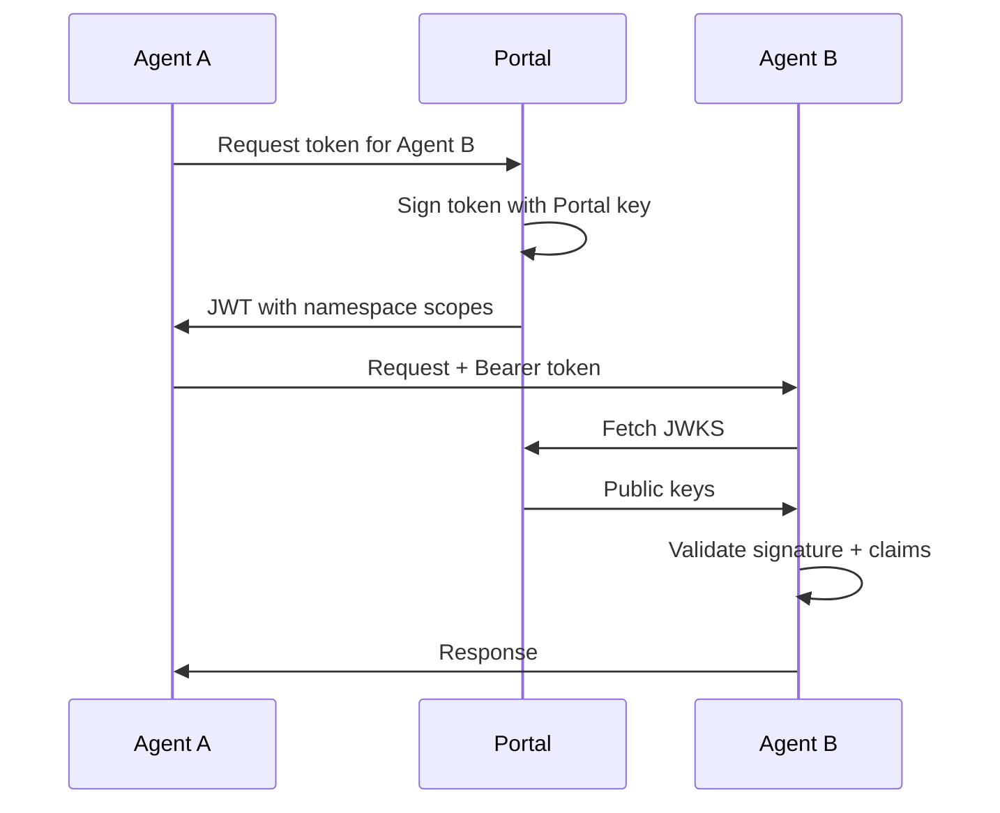
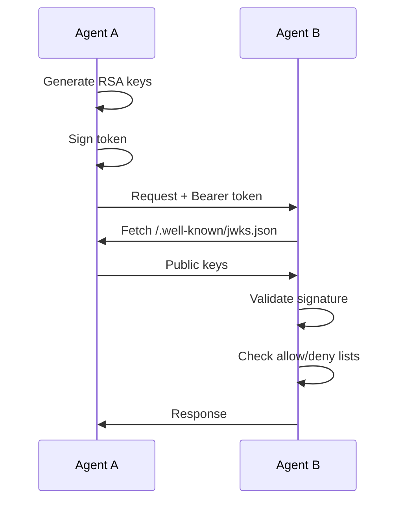

# AOAuth Skill

Agent OAuth (AOAuth) is an OAuth 2.0 extension for agent-to-agent authentication. It supports both centralized Portal mode and decentralized self-issued mode.

## Overview

The AOAuth skill provides:

- **Token Generation** - Create signed JWT tokens for agent-to-agent calls
- **Token Validation** - Verify incoming tokens from trusted issuers
- **Automatic Injection** - Hooks inject Bearer tokens into outgoing requests
- **OIDC Discovery** - Standard endpoints for key and configuration discovery

### Operating Modes

| Mode | Description | Use Case |
|------|-------------|----------|
| **Portal** | Tokens signed by Robutler Portal with namespace scopes | Production deployments |
| **Self-Issued** | Agent generates and signs own tokens | Development, federated systems |

Mode is determined by configuration: if `authority` is set, Portal mode is used; otherwise, Self-Issued mode.

## Configuration

### Portal Mode (Production)

```yaml
skills:
  auth:
    authority: "https://robutler.ai"
    agent_id: "my-agent"
    allowed_scopes:
      - read
      - write
      - namespace:*
```

In Portal mode:
- Portal signs all tokens and assigns namespace scopes
- Token validation uses Portal's JWKS
- Centralized trust management

### Self-Issued Mode (Development)

```yaml
skills:
  auth:
    base_url: "@my-local-agent"
    allowed_scopes:
      - read
      - write
    allow:
      - "@myteam/*"
      - "@trusted-agent"
    deny:
      - "@banned-*"
```

In Self-Issued mode:
- Agent generates RSA keys and signs own tokens
- Publishes JWKS at `/.well-known/jwks.json`
- Trust managed via allow/deny lists with glob patterns

### Full Configuration Reference

```yaml
skills:
  auth:
    # Operating Mode
    authority: "https://robutler.ai"  # Set for Portal mode, omit for self-issued
    
    # Agent Identity
    agent_id: "my-agent"              # Unique agent identifier
    base_url: "@my-agent"             # Agent URL (or @name for normalization)
    
    # Token Settings
    token_ttl: 300                    # Token lifetime in seconds (default: 5 min)
    
    # Scope Control
    allowed_scopes:                   # Scopes this agent accepts
      - read
      - write
      - namespace:*                   # Wildcard for all namespace scopes
      - tools:*                       # Wildcard for all tool scopes
    
    # Trust Configuration
    trusted_issuers:                  # Explicit trusted issuers
      - issuer: "https://partner.ai"
        jwks_uri: "https://partner.ai/.well-known/jwks.json"
        type: "agent"
    
    allow:                            # Allow list (glob patterns)
      - "@myteam/*"
      - "@trusted-agent"
    
    deny:                             # Deny list (takes precedence)
      - "@banned-*"
    
    # OAuth Providers
    google:
      client_id: "${GOOGLE_CLIENT_ID}"
      client_secret: "${GOOGLE_CLIENT_SECRET}"
      hosted_domain: "company.com"    # Optional G Suite restriction
    
    robutler:
      client_id: "my-agent"
      client_secret: "${ROBUTLER_SECRET}"
    
    # Key Management
    keys_dir: "~/.webagents/keys"     # RSA key storage
    jwks_cache_ttl: 3600              # JWKS cache lifetime (1 hour)
```

## Usage

### Python API

```python
from webagents.agents.skills.local.auth import AuthSkill

# Create skill
auth_skill = AuthSkill({
    "authority": "https://robutler.ai",
    "agent_id": "my-agent",
})

# Add to agent
agent = BaseAgent(
    name="my-agent",
    skills=[auth_skill],
)

# Generate token for another agent
token = auth_skill.generate_token("@target-agent", ["read", "write"])

# Validate incoming token
auth_context = await auth_skill.validate_token(token)
if auth_context and auth_context.authenticated:
    print(f"Authenticated: {auth_context.agent_id}")
    print(f"Scopes: {auth_context.scopes}")
    print(f"Namespaces: {auth_context.namespaces}")
```

### Automatic Token Handling

The skill registers hooks for automatic token handling:

- **`on_request_outgoing`** - Injects Bearer token into outgoing agent requests
- **`on_connection`** - Validates incoming Bearer tokens and attaches `AuthContext`

No manual token handling required for standard agent-to-agent calls.

## CLI Commands

| Command | Description |
|---------|-------------|
| `webagents login` | Authenticate with robutler.ai |
| `webagents logout` | Clear credentials |
| `webagents whoami` | Show current authenticated user |
| `webagents token` | Display current token |
| `webagents token --refresh` | Refresh token |

### Slash Commands (REPL)

| Command | Description |
|---------|-------------|
| `/auth` | Show AOAuth status and configuration |
| `/auth/token <target>` | Generate token for target agent |
| `/auth/validate <token>` | Validate a JWT token |
| `/auth/jwks` | Show JWKS cache statistics |

## HTTP Endpoints

The skill exposes standard OAuth/OIDC endpoints:

| Endpoint | Description |
|----------|-------------|
| `/.well-known/openid-configuration` | OpenID Connect Discovery |
| `/.well-known/jwks.json` | JSON Web Key Set (public keys) |
| `/auth/token` | OAuth token endpoint |

### Token Endpoint

```bash
# Client credentials grant (agent-to-agent)
curl -X POST https://agent.example.com/auth/token \
  -d "grant_type=client_credentials" \
  -d "client_id=caller-agent" \
  -d "client_secret=secret" \
  -d "scope=read write" \
  -d "target=@target-agent"
```

## JWT Token Structure

AOAuth tokens include standard OAuth claims plus AOAuth-specific extensions:

```json
{
  "iss": "https://robutler.ai",
  "sub": "agent-a",
  "aud": "https://robutler.ai/agents/agent-b",
  "exp": 1234567890,
  "iat": 1234567890,
  "jti": "unique-token-id",
  "scope": "read write namespace:production",
  "client_id": "agent-a",
  "token_type": "Bearer",
  "aoauth": {
    "mode": "portal",
    "agent_url": "https://robutler.ai/agents/agent-a"
  }
}
```

### Scope Format

Scopes are space-separated strings:

- `read`, `write`, `admin` - Basic permissions
- `namespace:production` - Portal-assigned namespace membership
- `tools:search` - Tool-specific access

Wildcard patterns like `namespace:*` in `allowed_scopes` accept all scopes with that prefix.

## Trust Model

### Portal Mode



### Self-Issued Mode



## AuthContext

The `AuthContext` object is attached to the request context after validation:

```python
@dataclass
class AuthContext:
    user_id: Optional[str]          # User identity
    agent_id: Optional[str]         # Agent identity
    source_agent: Optional[str]     # Calling agent
    authenticated: bool             # Validation succeeded
    scopes: List[str]               # Granted scopes
    namespaces: List[str]           # Extracted namespace:* scopes
    issuer: Optional[str]           # Token issuer
    issuer_type: str                # "portal", "agent", "user"
    raw_claims: Dict[str, Any]      # Full JWT claims
```

### Checking Permissions

```python
from webagents.server.context.context_vars import get_context

context = get_context()
auth = context.auth

# Check specific scope
if auth.has_scope("write"):
    # Allowed to write

# Check namespace access
if auth.has_namespace("production"):
    # Has production namespace access
```

## Security Considerations

1. **Key Storage** - RSA keys stored in `~/.webagents/keys/` with proper permissions
2. **Token TTL** - Default 5 minutes; adjust based on security requirements
3. **Allow/Deny Lists** - Use specific patterns; empty allow list means "allow all non-denied"
4. **JWKS Caching** - Smart caching with auto-refresh on key rotation
5. **Portal Mode** - Recommended for production; centralizes trust management

## Dependencies

```
PyJWT>=2.8
cryptography>=41.0
httpx>=0.25
```

## See Also

- [AOAuth Protocol Specification](../protocols/aoauth.md)
- [Platform Auth Skill](platform/auth.md)
