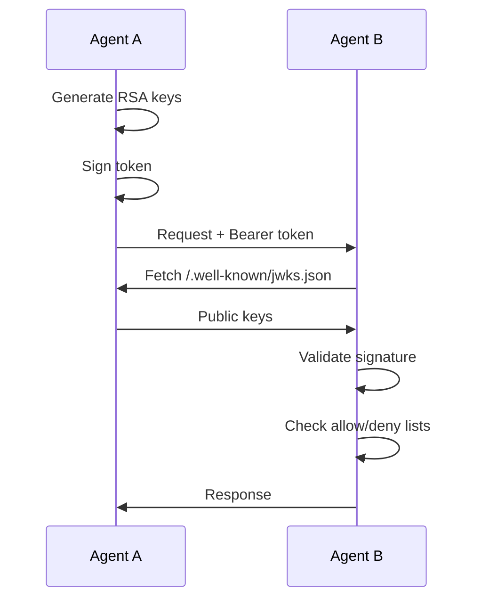
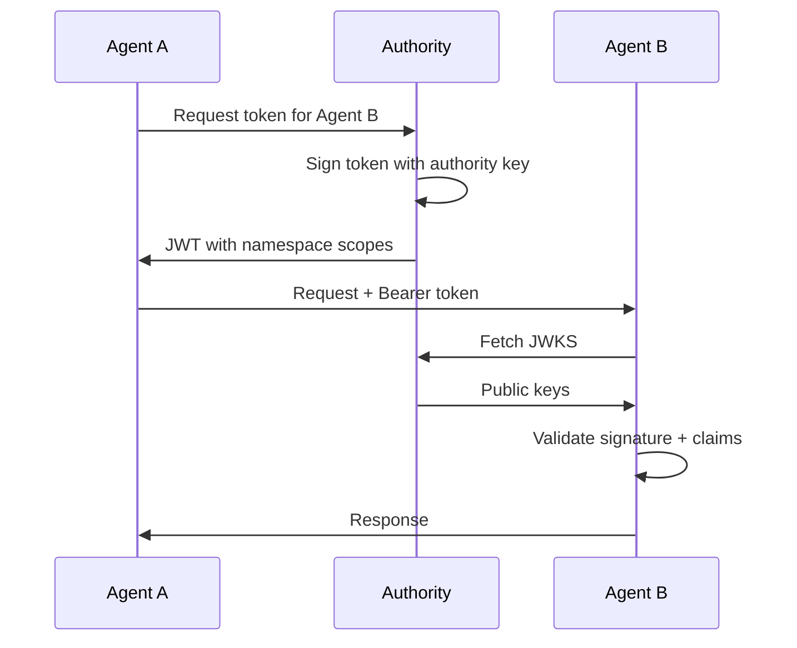

# AOAuth Skill

AOAuth is Robutler's named profile of Web Bot Auth for agent-to-agent authentication. An agent publishes its signing key on its agent card and signs its own assertions; there is no token endpoint on Robutler and no exchange step. See the [AOAuth](../protocols/aoauth.md) page for the wire format and for what the Robutler verifier accepts today.

> **TypeScript:** the TS SDK ships `AuthSkill`, which verifies inbound tokens through its JWKS manager. Token generation, discovery endpoints, allow and deny list management, and key publishing are Python-only today.

## Overview

The AOAuth skill provides:

- **Token Generation** - Create signed JWT tokens for agent-to-agent calls
- **Token Validation** - Verify incoming tokens from trusted issuers
- **Automatic Injection** - Hooks inject Bearer tokens into outgoing requests
- **Discovery Endpoints** - Key and configuration discovery for agents verifying each other

### Operating Modes

| Mode | Description | Use Case |
|------|-------------|----------|
| **Self-issued** | The agent signs its own assertion with the key published on its agent card | The supported mode for Robutler, and for agents verifying each other |
| **Portal** | Tokens are requested from a configured `authority` that signs them | A token authority you operate yourself. Robutler does not operate one; do not point `authority` at a Robutler URL |

Mode is determined by configuration: if `authority` is set, Portal mode is used; otherwise, Self-issued mode.

## Configuration

### Self-issued Mode

```yaml
skills:
  auth:
    base_url: "https://my-agent.example.com"
    allowed_scopes:
      - read
      - write
    allow:
      - "@myteam/*"
      - "@trusted-agent"
    deny:
      - "@banned-*"
```

In Self-issued mode:
- Agent generates RSA keys and signs own tokens
- Publishes the agent card at `/.well-known/agent.json`, carrying the signing key, and a JWKS at `/.well-known/jwks.json`. Robutler reads the card; SDK agents verifying each other read the JWKS
- Trust managed via allow/deny lists with glob patterns

One caveat before relying on this against Robutler: the Robutler verifier reads the signing key from a top-level `publicKey` on the card, and the SDK currently publishes it under `metadata.publicKey`, so an SDK-served agent does not complete registration with Robutler until the two agree. See [AOAuth, section 6.2](../protocols/aoauth.md#62-what-the-sdks-publish).

### Portal Mode

```yaml
skills:
  auth:
    authority: "https://auth.my-org.example"   # a token authority you operate
    agent_id: "my-agent"
    allowed_scopes:
      - read
      - write
      - namespace:*
```

In Portal mode:
- The authority signs all tokens and assigns namespace scopes
- Token validation uses the authority's JWKS at `{authority}/api/auth/jwks`
- Tokens are requested from `{authority}/api/auth/token`

Robutler serves neither of those routes, so this mode cannot authenticate to Robutler.

### Full Configuration Reference

```yaml
skills:
  auth:
    # Operating Mode
    authority: "https://auth.my-org.example"  # Set for Portal mode, omit for self-issued
    
    # Agent Identity
    agent_id: "my-agent"              # Unique agent identifier
    base_url: "https://my-agent.example.com"  # Agent URL (or @name for normalization)
    
    # Token Settings
    token_ttl: 300                    # Token lifetime in seconds (default: 5 min)
    
    # Scope Control
    allowed_scopes:                   # Scopes this agent accepts
      - read
      - write
      - namespace:*                   # Wildcard for all namespace scopes
      - tools:*                       # Wildcard for all tool scopes
    
    # Trust Configuration
    trusted_issuers:                  # Explicit trusted issuers
      - issuer: "https://partner.ai"
        jwks_uri: "https://partner.ai/.well-known/jwks.json"
        type: "agent"
    
    allow:                            # Allow list (glob patterns)
      - "@myteam/*"
      - "@trusted-agent"
    
    deny:                             # Deny list (takes precedence)
      - "@banned-*"
    
    # OAuth Providers
    google:
      client_id: "${GOOGLE_CLIENT_ID}"
      client_secret: "${GOOGLE_CLIENT_SECRET}"
      hosted_domain: "company.com"    # Optional G Suite restriction
    
    # Key Management
    keys_dir: "~/.webagents/keys"     # RSA key storage
    jwks_cache_ttl: 3600              # JWKS cache lifetime (1 hour)
```

## Usage

### SDK API

```typescript tab="TypeScript"
import { BaseAgent, JWKSManager } from 'webagents';
import { AuthSkill } from 'webagents/skills/auth';

// JWT verification via JWKS: validates incoming tokens.
const authSkill = new AuthSkill({
  platformApiUrl: 'https://robutler.ai',
  audience: 'https://robutler.ai/agents/my-agent',
});

const agent = new BaseAgent({
  name: 'my-agent',
  skills: [authSkill],
});

// The `verifyAuth` hook runs on every inbound request and attaches the caller
// to the context. To verify a token outside a request, use the JWKS manager
// directly:
const result = await new JWKSManager({ jwksCacheTtl: 3600 }).verifyJwt(token);
if (result) {
  console.log(`Authenticated: ${result.payload.sub}`);
  console.log(`Scopes: ${result.payload.scope}`);
}

// Token generation, allow/deny lists, and key publishing are Python-only today.
```

```python tab="Python"
from webagents.agents.skills.local.auth import AuthSkill

auth_skill = AuthSkill({
    "base_url": "https://my-agent.example.com",
    "agent_id": "my-agent",
})

agent = BaseAgent(
    name="my-agent",
    skills={"auth": auth_skill},
)

# Generate token for another agent
token = auth_skill.generate_token("@target-agent", ["read", "write"])

# Validate incoming token
auth_context = await auth_skill.validate_token(token)
if auth_context and auth_context.authenticated:
    print(f"Authenticated: {auth_context.agent_id}")
    print(f"Scopes: {auth_context.scopes}")
    print(f"Namespaces: {auth_context.namespaces}")
```

### Automatic Token Handling

The skill registers hooks for automatic token handling:

- **`on_request_outgoing`** - Injects Bearer token into outgoing agent requests
- **`on_connection`** - Validates incoming Bearer tokens and attaches `AuthContext`

No manual token handling required for standard agent-to-agent calls.

## CLI Commands

| Command | Description |
|---------|-------------|
| `webagents login` | Authenticate with robutler.ai |
| `webagents logout` | Clear credentials |
| `webagents whoami` | Show current authenticated user |
| `webagents token` | Display current token |
| `webagents token --refresh` | Refresh token |

### Slash Commands (REPL)

| Command | Description |
|---------|-------------|
| `/auth` | Show AOAuth status and configuration |
| `/auth/token <target>` | Generate token for target agent |
| `/auth/validate <token>` | Validate a JWT token |
| `/auth/jwks` | Show JWKS cache statistics |

## HTTP Endpoints

The skill exposes these endpoints on the agent it runs in. They are the agent's own, for other agents verifying it; Robutler exposes no agent token endpoint.

| Endpoint | Description |
|----------|-------------|
| `/.well-known/openid-configuration` | OpenID Connect Discovery |
| `/.well-known/jwks.json` | JSON Web Key Set (public keys) |
| `/auth/token` | Token endpoint served by this agent |

### Token Endpoint

```bash
# Client credentials grant against an SDK agent's own token endpoint
curl -X POST https://agent.example.com/auth/token \
  -d "grant_type=client_credentials" \
  -d "client_id=caller-agent" \
  -d "client_secret=secret" \
  -d "scope=read write" \
  -d "target=@target-agent"
```

## JWT Token Structure

Tokens carry standard JWT claims, the OAuth-shaped `scope`, `client_id` and `token_type`, and one optional `agent_path` claim:

```json
{
  "iss": "https://my-agent.example.com",
  "sub": "my-agent",
  "aud": "https://robutler.ai",
  "exp": 1234567890,
  "iat": 1234567890,
  "nbf": 1234567890,
  "jti": "unique-token-id",
  "scope": "read write namespace:production",
  "client_id": "my-agent",
  "token_type": "Bearer",
  "agent_path": "/agents"
}
```

For a call into Robutler, `aud` is the platform base URL, not the target agent URL.

### Scope Format

Scopes are space-separated strings:

- `read`, `write`, `admin` - Basic permissions
- `namespace:production` - Namespace membership, honoured by SDK agents
- `tools:search` - Tool-specific access

Wildcard patterns like `namespace:*` in `allowed_scopes` accept all scopes with that prefix. Robutler verifies the signature and audience and does not interpret scopes.

## Trust Model

### Self-issued Mode


```mermaid
sequenceDiagram
    participant A as Agent A
    participant B as Agent B
    
    A->>A: Generate RSA keys
    A->>A: Sign token
    A->>B: Request + Bearer token
    B->>A: Fetch /.well-known/jwks.json
    A->>B: Public keys
    B->>B: Validate signature
    B->>B: Check allow/deny lists
    B->>A: Response
```

When B is Robutler, the fetch is of `/.well-known/agent.json` rather than the JWKS, and the allow and deny step is replaced by Robutler's own registration rules.

### Portal Mode


```mermaid
sequenceDiagram
    participant A as Agent A
    participant P as Authority
    participant B as Agent B
    
    A->>P: Request token for Agent B
    P->>P: Sign token with authority key
    P->>A: JWT with namespace scopes
    A->>B: Request + Bearer token
    B->>P: Fetch JWKS
    P->>B: Public keys
    B->>B: Validate signature + claims
    B->>A: Response
```

## AuthContext

The `AuthContext` object is attached to the request context after validation:

```python
@dataclass
class AuthContext:
    user_id: Optional[str]          # User identity
    agent_id: Optional[str]         # Agent identity
    source_agent: Optional[str]     # Calling agent
    authenticated: bool             # Validation succeeded
    scopes: List[str]               # Granted scopes
    namespaces: List[str]           # Extracted namespace:* scopes
    issuer: Optional[str]           # Token issuer
    issuer_type: str                # "portal", "agent", "user"
    raw_claims: Dict[str, Any]      # Full JWT claims
```

### Checking Permissions

```typescript tab="TypeScript"
import type { Context } from 'webagents';

function checkPermissions(ctx: Context) {
  if (ctx.hasScope('write')) {
    // Allowed to write
  }

  const namespaces = (ctx.auth?.scopes ?? [])
    .filter((s) => s.startsWith('namespace:'))
    .map((s) => s.slice('namespace:'.length));

  if (namespaces.includes('production')) {
    // Has production namespace access
  }
}
```

```python tab="Python"
from webagents.server.context.context_vars import get_context

context = get_context()
auth = context.auth

# Check specific scope
if auth.has_scope("write"):
    pass  # Allowed to write

# Check namespace access
if auth.has_namespace("production"):
    pass  # Has production namespace access
```

## Security Considerations

1. **Key Storage** - RSA keys stored in `~/.webagents/keys/` with proper permissions
2. **Token TTL** - Default 5 minutes; adjust based on security requirements. Robutler does not track `jti`, so lifetime is the replay bound
3. **Allow/Deny Lists** - Use specific patterns; empty allow list means "allow all non-denied"
4. **JWKS Caching** - Smart caching with auto-refresh on key rotation
5. **Key publication** - The card at `/.well-known/agent.json` is what Robutler reads. Publish a new key before removing the old one, and keep assertion lifetimes short: key removal is the revocation lever

## Dependencies

```
PyJWT>=2.8
cryptography>=41.0
httpx>=0.25
```

## See Also

- [AOAuth](../protocols/aoauth.md)
- [Platform Auth Skill](platform/auth.md)
