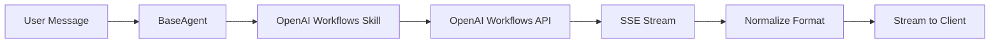

# OpenAI Workflows Skill

Execute OpenAI hosted agents and workflows seamlessly within your WebAgents, with real-time streaming and automatic cost tracking.

## Overview

The OpenAI Agent Builder skill allows you to integrate OpenAI's hosted workflows as handoff handlers, enabling you to leverage OpenAI's agent building capabilities while maintaining full integration with the WebAgents platform.

**Key Features:**

- 🌊 **Real-time streaming** - Word-by-word response streaming
- 💰 **Automatic cost tracking** - Token usage logged for accurate billing
- 🔄 **Session support** - Multi-turn conversations with memory
- 🔌 **Seamless handoffs** - Integrates as a standard handoff handler
- 📊 **Tracing enabled** - Built-in debugging and monitoring
- 🧠 **Thinking support** - Detects and wraps reasoning model thinking in `<think>` tags

## Installation

The OpenAI Workflows skill is included in the ecosystem skills package:

```python
from webagents.agents.skills.ecosystem.openai import OpenAIAgentBuilderSkill
```

## Configuration

### Credential Sources (in order of precedence)

1. **KV Storage** - Credentials stored via setup form or `update_openai_credentials` tool (when KV skill available)
2. **Config** - Passed in skill configuration dictionary
3. **Environment** - `OPENAI_API_KEY` environment variable (`.env` file)

### Parameters

- **`workflow_id`**: OpenAI workflow ID (optional if using KV storage)
- **`api_key`**: OpenAI API key (optional, defaults to KV storage or `OPENAI_API_KEY` env var)
- **`api_base`**: OpenAI API base URL (default: `https://api.openai.com/v1`)
- **`version`**: Workflow version (default: `None` = latest)

!!! tip "Best Practice: Omit Version"
    Don't specify a version unless required. When omitted, the workflow uses its default version, which:
    
    - ✅ Automatically uses the latest stable version
    - ✅ Benefits from workflow improvements
    - ✅ Reduces maintenance burden
    
    Only specify version if you need a specific workflow structure or the default doesn't work.

## Multitenancy Support

The OpenAI Workflows skill supports **per-agent-owner credential storage** when a KV skill is available. This allows agent owners to configure their own OpenAI credentials without requiring server-wide environment variables.

### How It Works

**With KV Skill Available:**

- Agent owners can store their OpenAI API key and workflow ID securely in KV storage
- Credentials are scoped to the agent owner's namespace
- All users of the agent share the agent owner's configured credentials
- Fallback to environment variables if credentials not configured in KV

**Without KV Skill:**

- Credentials loaded from environment variables (`OPENAI_API_KEY`) and config (`workflow_id`)
- Traditional single-tenant behavior

### Setting Up Credentials

#### Option 1: Setup Form (Recommended for Multitenancy)

When KV skill is available, visit the setup URL:

```
{agent_base_url}/{agent-name}/setup/openai
```

For example:
```
http://localhost:2224/agents/my-agent/setup/openai
```

This displays a web form where you can enter:
- OpenAI API Key (`sk-...`)
- Workflow ID (`wf_...`)

#### Option 2: Programmatic Update

Use the `update_openai_credentials` tool:

```python
# Update credentials
await skill.update_openai_credentials(
    api_key="sk-proj-your-key-here",
    workflow_id="wf_68...70"
)
```

#### Option 3: Remove Credentials

To remove stored credentials and fall back to environment variables:

```python
await skill.update_openai_credentials(remove=True)
```

### Setup Guidance

When KV skill is available but credentials aren't configured, the skill automatically provides setup instructions:

- **In prompt**: Setup URL is included in the agent's system prompt
- **In errors**: If execution fails due to missing credentials, error message includes setup link

### Example with KV Skill

```python
from webagents.agents.core.base_agent import BaseAgent
from webagents.agents.skills.ecosystem.openai import OpenAIAgentBuilderSkill
from webagents.agents.skills.core.kv import KVSkill

agent = BaseAgent(
    name="workflow-agent",
    instructions="You are powered by OpenAI workflows",
    skills={
        "kv": KVSkill(),  # Enable multitenancy
        "openai_workflow": OpenAIAgentBuilderSkill({
            # workflow_id and api_key now optional - can be configured via KV
        })
    }
)
```

Agent owner visits `{base_url}/agents/workflow-agent/setup/openai` to configure their credentials.

!!! warning "Credential Ownership"
    Credentials are stored per **agent owner**, not per end-user. All users interacting with the agent will use the agent owner's OpenAI account.

## Basic Usage

### With BaseAgent

```python
from webagents.agents.core.base_agent import BaseAgent
from webagents.agents.skills.ecosystem.openai import OpenAIAgentBuilderSkill

agent = BaseAgent(
    name="workflow-agent",
    instructions="You are powered by OpenAI workflows",
    skills={
        "openai_workflow": OpenAIAgentBuilderSkill({
            'workflow_id': 'wf_68e56f477fe48190ad3056eff9ad5e0200d2d26229af6c70'
        })
    }
)

# Run streaming
async for chunk in agent.run_streaming([
    {"role": "user", "content": "Hello!"}
]):
    print(chunk)
```

### Environment Setup

Create a `.env` file:

```bash
OPENAI_API_KEY=sk-proj-your-key-here
```

The skill automatically loads this key at initialization.

## How It Works

### Message Flow

1. **Input**: Standard OpenAI chat format messages
2. **Filter**: Only user messages sent to workflow (system/assistant filtered out)
3. **Convert**: Transform to workflow input format
4. **Stream**: SSE events from OpenAI workflows API
5. **Normalize**: Convert to OpenAI completion chunks
6. **Yield**: Real-time to client

### Message Filtering

OpenAI workflows don't handle `system` or `assistant` roles. The skill automatically filters:

```python
# Input
[
  {"role": "system", "content": "You are helpful"},
  {"role": "user", "content": "Hello!"},
  {"role": "assistant", "content": "Hi there!"},
  {"role": "user", "content": "How are you?"}
]

# Sent to workflow (user messages only)
[
  {"role": "user", "content": "Hello!"},
  {"role": "user", "content": "How are you?"}
]
```

### Streaming Deltas

The skill extracts word-by-word deltas from `workflow.node.agent.response` events:

```
workflow.started → workflow.node.agent.response (delta: "Hello")
                → workflow.node.agent.response (delta: " there")
                → workflow.node.agent.response (delta: "!")
                → workflow.finished
```

Each delta is immediately yielded as a streaming chunk for real-time display.

## Usage Tracking

Token usage is automatically tracked and logged to `context.usage`:

```python
{
    'type': 'llm',
    'timestamp': 1759984808.392,
    'model': 'gpt-5-nano-2025-08-07',
    'prompt_tokens': 17,
    'completion_tokens': 208,
    'total_tokens': 225,
    'streaming': True,
    'source': 'openai_workflow'
}
```

This integrates with the Payment Skill for automatic cost calculation and billing.

## Special Content Detection

The skill automatically detects and wraps special content types for proper UI rendering.

### Thinking Content

Thinking/reasoning content is wrapped in `<think>` tags.

### Type-Based Detection

Detection is based purely on the `type` field in OpenAI's SSE responses - **no model name checking required**:

1. **Type field monitoring** - Checks `response_data.get('type')` for keywords
2. **Automatic wrapping** - Opens `<think>` tag when `reasoning`, `thinking`, or `summary` detected
3. **Smart closure** - Closes `</think>` tag when type changes to regular content
4. **Guaranteed closure** - Ensures tags are closed at workflow finish

**Why this works**: OpenAI workflows explicitly mark content types in their SSE responses, making detection reliable regardless of which model is used.

### OpenAI Workflow Format

OpenAI workflows use specific type markers in their SSE responses:

```json
{
  "delta": "Let me think about this...",
  "type": "response.reasoning_summary_text.delta",  // Thinking content
  ...
}
```

```json
{
  "delta": "Based on my analysis...",
  "type": "response.text.delta",  // Regular output
  ...
}
```

### Example Output

For any workflow that generates thinking content (e.g., gpt5-nano, o1, o3):

```
<think>
**Analyzing the problem**

I need to consider:
1. The core requirements
2. Potential edge cases
3. Performance implications

Let me work through this step by step...
</think>

Based on my analysis, I recommend approach B because...
```

### Supported Type Markers

The skill wraps content when the delta `type` field contains:
- `"reasoning"` - Reasoning/chain-of-thought content
- `"thinking"` - Internal thought process
- `"summary"` - Reasoning summaries

Common OpenAI workflow types:
- `response.reasoning_summary_text.delta` → Wrapped in `<think>`
- `response.text.delta` → Regular output (not wrapped)

### Widget Rendering

The skill automatically detects and wraps OpenAI ChatKit widgets in `<widget>` tags for interactive UI components.

#### Widget Detection

When a workflow emits `workflow.node.agent.widget` events:

```json
{
  "type": "workflow.node.agent.widget",
  "widget": "{\"type\":\"Card\",\"children\":[...]}"
}
```

The skill extracts the widget JSON and wraps it:

```
<widget>{"type":"Card","children":[...]}</widget>
```

#### Supported Widget Types

Based on the [OpenAI ChatKit Widget Spec](https://openai.github.io/chatkit-python/api/chatkit/widgets/):

- **Card** - Container with optional styling and background
- **Row** - Horizontal layout with flex alignment
- **Col** - Vertical layout with configurable gap
- **Text** - Display text with size and color options
- **Caption** - Small text for labels and metadata
- **Image** - Display images with configurable size
- **Spacer** - Flexible space for layout
- **Divider** - Horizontal separator line
- **Box** - Generic container with width/height/background/border-radius
- **Button** - Interactive button (click handlers supported)

#### Example Widget

Flight status card from your workflow:

```json
{
  "type": "Card",
  "size": "md",
  "background": "linear-gradient(135deg, #378CD1 0%, #2B67AC 100%)",
  "children": [
    {"type": "Row", "children": [
      {"type": "Image", "src": "...", "size": 16},
      {"type": "Caption", "value": "AA247"},
      {"type": "Spacer"},
      {"type": "Caption", "value": "2025-10-09", "color": "alpha-50"}
    ]},
    {"type": "Divider", "flush": true},
    {"type": "Col", "gap": 3, "children": [
      {"type": "Row", "align": "center", "children": [
        {"type": "Text", "value": "New York, JFK"},
        {"type": "Spacer"},
        {"type": "Text", "value": "Los Angeles, LAX"}
      ]}
    ]}
  ]
}
```

This renders as an interactive card showing flight information with proper styling, layout, and visual hierarchy.

## Advanced Configuration

### Pin to Specific Version

```python
OpenAIAgentBuilderSkill({
    'workflow_id': 'wf_68e56f477fe48190ad3056eff9ad5e0200d2d26229af6c70',
    'version': '3'  # Pin to version 3
})
```

### Custom API Base

```python
OpenAIAgentBuilderSkill({
    'workflow_id': 'wf_68e56f477fe48190ad3056eff9ad5e0200d2d26229af6c70',
    'api_base': 'https://custom-api.example.com/v1'
})
```

## Testing

Test the workflow directly with curl:

```bash
curl 'https://api.openai.com/v1/workflows/wf_YOUR_WORKFLOW_ID/run' \
  -H 'authorization: Bearer YOUR_OPENAI_API_KEY' \
  -H 'content-type: application/json' \
  --data-raw '{
    "input_data": {
      "input": [{
        "role": "user",
        "content": [{"type": "input_text", "text": "hi"}]
      }]
    },
    "state_values": [],
    "session": true,
    "tracing": {"enabled": true},
    "stream": true
  }'
```

## Handoff Integration

The skill registers itself as a streaming handoff handler:

```python
agent.register_handoff(
    Handoff(
        target=f"openai_workflow_{workflow_id}",
        description=f"OpenAI Workflow handler",
        metadata={
            'function': self.run_workflow_stream,
            'priority': 10,
            'is_generator': True  # Streaming enabled
        }
    )
)
```

This allows the agent to use OpenAI workflows as its primary completion handler.

## Architecture



## Error Handling

- **HTTP Errors**: Captured and returned as error messages
- **Malformed SSE**: Logged and skipped
- **Connection Timeouts**: 120s default timeout
- **Workflow Failures**: `workflow.failed` events converted to error responses

## Limitations

1. **User Messages Only**: System and assistant messages are filtered out
2. **No Tool Calling**: Workflows don't support external tool integration
3. **Workflow-Specific Versions**: Each workflow has its own versioning scheme

## Best Practices

1. ✅ Use `OPENAI_API_KEY` from environment, not config
2. ✅ Omit `version` unless you need a specific structure
3. ✅ Test workflows with curl before integration
4. ✅ Monitor usage logs to verify cost tracking
5. ✅ Enable session support for multi-turn conversations

## API Reference

::: webagents.agents.skills.ecosystem.openai.skill.OpenAIAgentBuilderSkill
    options:
      show_source: true
      members:
        - __init__
        - initialize
        - run_workflow_stream

## Related Documentation

- [Handoffs System](../../agent/handoffs.md)
- [Payment Skill](../platform/payments.md)
- [Agent Skills](../../agent/skills.md)

