# Integration Tests for External Tools

## Overview

This directory contains **true integration tests** with **no mocking** for the external tools system. These tests use:

- ✅ **Real FastAPI server** (RobutlerServer)
- ✅ **Real HTTP requests** (httpx client)  
- ✅ **Real LLM API calls** (LiteLLM → OpenAI)
- ✅ **Real agent skills** (LiteLLMSkill, calculator tools)
- ✅ **Complete request/response cycle**

## Critical Understanding: External Tools

**🔧 EXTERNAL TOOLS** = Tools specified in OpenAI ChatCompletion request's `tools` parameter

- **Execution**: **CLIENT-side** (not server-side)
- **Server Role**: Pass to LLM, return `tool_calls` to client
- **Purpose**: Client-specific capabilities (user files, client APIs, user permissions)

**🤖 AGENT TOOLS** = Functions decorated with `@tool` in agent skills

- **Execution**: **SERVER-side** by the agent
- **Registration**: Automatic via `@tool` decorator
- **Purpose**: Internal agent capabilities (database, calculations, file operations)

## Test Files

### `test_external_tools_integration.py`

**Comprehensive integration test for external tools flow:**

1. **Client** sends request with external tools to real server
2. **Server** passes external tools to LLM (via LiteLLM/OpenAI)
3. **LLM** responds with `tool_calls` for external tools
4. **Server** returns `tool_calls` to client (NOT executing them server-side)
5. **Client** executes external tools and sends results back
6. **Server** continues conversation with tool results

**Test Scenarios:**
- ✅ External tools returned to client (not executed server-side)
- ✅ Mixed tools (agent tools executed server-side, external tools returned)
- ✅ Streaming with external tools
- ✅ Tool merging (agent tools + external tools for LLM)
- ✅ Complete conversation flow with tool results

## Requirements

### Environment Variables

```bash
# Required for real LLM calls
export OPENAI_API_KEY="sk-your-openai-api-key-here"

# Optional: Use LiteLLM proxy instead of direct OpenAI
export LITELLM_BASE_URL="http://localhost:4000"  # If using LiteLLM proxy
```

### Dependencies

```bash
# Install test dependencies
pip install pytest pytest-asyncio httpx uvicorn

# Install Robutler
pip install -e .
```

## Running Tests

### Run All Integration Tests

```bash
cd robutler
python -m pytest tests/integration/ -v -s
```

### Run External Tools Test Only

```bash
cd robutler
python -m pytest tests/integration/test_external_tools_integration.py -v -s
```

### Run Test Directly (Debug Mode)

```bash
cd robutler
python tests/integration/test_external_tools_integration.py
```

### Skip Integration Tests (No API Key)

```bash
# Integration tests are skipped if OPENAI_API_KEY is not set
python -m pytest tests/integration/ -v --tb=short
```

## Test Output Example

```bash
🚀 Starting External Tools Integration Test
✅ Server health check passed
📤 Sending request with 2 external tools
📥 Received response: {...}
🔧 Server returned 1 tool_calls to client
✅ All returned tool_calls are external tools (correct!)
🖥️ Client executed 1 external tools
🔄 Sending tool results back to continue conversation
💬 Final response: Based on the weather information...
✅ Server successfully processed external tool results!

🔀 Testing mixed tools scenario
🔧 LLM requested tools: ['add_numbers', 'get_weather']
✅ Mixed scenario: Both agent and external tools requested

🌊 Testing external tools with streaming
📊 Received 15 streaming chunks
✅ Tool calls found in streaming response
✅ Streaming with external tools test completed

🎉 ALL EXTERNAL TOOLS INTEGRATION TESTS PASSED!
```

## Test Architecture

```mermaid
graph TB
    Test[🧪 Integration Test] --> Client[📱 HTTP Client]
    Client -->|Real HTTP| Server[🖥️ Real FastAPI Server]
    
    Server --> Agent[🤖 BaseAgent]
    Agent --> LLM[🧠 LiteLLMSkill]
    Agent --> Calc[🔢 CalculatorSkill]
    
    LLM -->|Real API call| OpenAI[🌐 OpenAI API]
    
    Test -->|Simulates| ClientExec[📱 Client Tool Execution]
    
    classDef testClass fill:#e1f5fe,stroke:#01579b,stroke-width:2px
    classDef realClass fill:#e8f5e8,stroke:#1b5e20,stroke-width:2px
    classDef apiClass fill:#fff3e0,stroke:#e65100,stroke-width:2px
    
    class Test,ClientExec testClass
    class Client,Server,Agent,LLM,Calc realClass
    class OpenAI apiClass
```



## Performance Expectations

- **Server startup**: ~3 seconds
- **First HTTP request**: <2 seconds
- **LLM API call**: 1-5 seconds (depends on OpenAI)
- **Tool execution**: <100ms (calculator)
- **Complete test suite**: 30-60 seconds

## Error Handling

The tests include comprehensive error handling:

- ✅ **Server startup failures**
- ✅ **HTTP connection errors** 
- ✅ **LLM API failures**
- ✅ **Invalid tool calls**
- ✅ **Malformed responses**
- ✅ **Timeout scenarios**

## Debugging

### Enable Debug Logging

```bash
export ROBUTLER_LOG_LEVEL="DEBUG"
python tests/integration/test_external_tools_real_server.py
```

### Check Server Status

```bash
# While test is running, check server health
curl http://localhost:8080/health
```

### Inspect LLM Calls

The real integration test makes actual calls to OpenAI. You can verify:

1. **OpenAI Dashboard** → Usage tab (see API calls)
2. **Server logs** → Check LiteLLM requests
3. **Test output** → Full request/response data

## Maintenance

### Updating Tests

When adding new external tools scenarios:

1. **Add new test method** in `ExternalToolsIntegrationTest`
2. **Update external tools** in `create_external_tools()`
3. **Add client simulation** in `simulate_client_tool_execution()`
4. **Verify OpenAI compliance** with real API responses

### Cost Management

To minimize OpenAI costs during testing:

- Use `gpt-4o-mini` (cheaper model)
- Keep test messages short
- Use LiteLLM caching if available
- Run tests sparingly (not in CI/CD until ready)

## Production Readiness

These tests validate that Robutler V2.0 is ready for production:

✅ **OpenAI Compatibility** - 100% compatible with OpenAI ChatCompletions API  
✅ **External Tools Flow** - Correct client/server responsibility separation  
✅ **Real-world Performance** - Tested with actual API latencies  
✅ **Error Resilience** - Handles all error scenarios gracefully  
✅ **Streaming Support** - External tools work in streaming context  
✅ **Tool Merging** - Agent tools + external tools combined properly  

**Result: Production-ready external tools implementation!** 🚀 